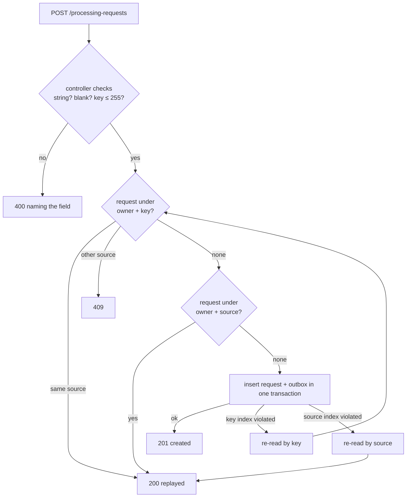

# API Hardening Design — catalog

**Spec**: `.specs/features/api-hardening/spec.md`
**Status**: Draft

---

## Architecture Overview

One request per `(owner, source)` is enforced the same way S6 enforced one request per `(owner, idempotencyKey)`. A lookup answers the common case, and a unique index settles the race. The create use case gains a second lookup and a second lost-race branch. The controller gains type and length checks ahead of the use case.

**Approach chosen for V32.**

| Approach | Verdict |
| --- | --- |
| **Unique `(owner_user_id, source_storage_key)` in the Catalog; a create for a known source returns its request** | **Chosen.** One writer and one constraint, and the same lost-race pattern as the key (S6). The API needs no new call. |
| The API tags the object with its request id and checks the tag before creating | Rejected: two sources of truth, and two confirmations can both read "no tag" before either writes it. |
| A Catalog lookup-by-source endpoint that the API calls before creating | Rejected: the same race as the tag, and one more route to keep owner-scoped. |

The key check stays **first**. A key bound to another source is still `409`, even when the new source already has a request.

---

## Code Reuse Analysis

### Existing Components to Leverage

| Component | Location | How to Use |
| --- | --- | --- |
| `isIdempotencyViolation` | `src/infrastructure/persistence/typeorm-processing-request.repository.ts:21` | Generalise to map each of the two constraint names to its own domain error |
| `DuplicateIdempotencyKeyError` | `src/domain/processing-request.repository.ts:8` | Sibling `DuplicateSourceError` with the same contract |
| Lost-race re-read | `src/application/create-processing-request.use-case.ts:101-113` | Same shape for the source branch |
| `AddIdempotencyKey` migration | `src/infrastructure/persistence/migrations/1789956000000-AddIdempotencyKey.ts` | Template for the new index migration and its `down` |
| Concurrency e2e | `test/idempotent-creation.e2e-spec.ts` | Same harness: parallel creates, a burst, a forced loser |
| `validateDto` | `src/interface/create-processing-request.controller.ts:66` | Extended per field: required → string → not blank → length |

### Integration Points

| System | Integration Method |
| --- | --- |
| PostgreSQL | Migration `1789957000000-UniqueOwnerSource` adds `uq_processing_request_owner_source` |
| `fiap-x-api` | No contract change: the 200 it already maps to `replayed` now also covers "known source" |
| `fiap-x-platform` | Spec C regenerates `db/create-database.sql` from the new migration |

---

## Components

### Migration `1789957000000-UniqueOwnerSource`

- **Purpose**: Make a second request for one owner's source impossible.
- **Location**: `src/infrastructure/persistence/migrations/1789957000000-UniqueOwnerSource.ts`
- **Interfaces**:
  - `up`: `CREATE UNIQUE INDEX "uq_processing_request_owner_source" ON "catalog"."processing_request" ("owner_user_id", "source_storage_key")`.
  - `down`: drop it.
- **Dependencies**: The `AddIdempotencyKey` migration runs before it.
- **Reuses**: The shape of the S6 migration.

### Repository port and adapters

- **Purpose**: Look a request up by source and report a lost source race as a domain error.
- **Location**: `src/domain/processing-request.repository.ts`, the in-memory and TypeORM adapters.
- **Interfaces**:
  - `findByOwnerAndSource(ownerUserId: string, sourceStorageKey: string): Promise<ProcessingRequest | undefined>`
  - `save` also throws `DuplicateSourceError`.
    - The TypeORM adapter maps `23505` on `uq_processing_request_owner_source` to it. Any other `23505` still passes through unchanged.
    - The in-memory adapter enforces the same uniqueness, including rows with a `NULL` key.
- **Reuses**: The S6 key mapping.

### `CreateProcessingRequestUseCase`

- **Purpose**: Return the existing request for a known source; write nothing.
- **Interfaces**: Unchanged (`{request, outcome: 'created' | 'replayed'}`).
- **Order**:
  1. `eventId` dedup
  2. domain validation
  3. key lookup, which answers replay or conflict
  4. source lookup, which answers replay
  5. transaction
- On `DuplicateIdempotencyKeyError`, re-read by key (as today). On `DuplicateSourceError`, re-read by source and return `replayed`. Both re-reads run outside the rolled-back transaction.

### `CreateProcessingRequestController.validateDto`

- **Purpose**: Answer every malformed input with `400`.
- **Rules**: For each of `ownerUserId`, `sourceStorageKey`, `idempotencyKey`, in this order:
  1. absent or `null` → `<field> is required`
  2. not a string → `<field> must be a string`
  3. blank → `<field> is required`
  4. for `idempotencyKey` only, longer than 255 → `idempotencyKey must be at most 255 characters`

---

## Data Models

`processing_request` gains no column. It gains the unique index `uq_processing_request_owner_source (owner_user_id, source_storage_key)`.

---

## Error Handling Strategy

| Error Scenario | Handling | User Impact |
| --- | --- | --- |
| New key, known source | Source lookup finds it → `replayed` | API gets `200`, same id |
| Two new keys racing on one source | The loser's insert violates the source index; its transaction rolls back; re-read by source | Both get the same id; one row, one outbox entry |
| Key bound to another source | Key lookup → `IdempotencyConflictError` | `409`, unchanged |
| Key of 256+ characters / a non-string field | Controller `400`, before any query | Named `400`, never `500` |
| Migration finds duplicate sources | `CREATE UNIQUE INDEX` fails, naming the index | Boot fails loudly (spec assumption: only pre-S6 local databases can have them) |

---

## Risks & Concerns

| Concern | Location (file:line) | Impact | Mitigation |
| --- | --- | --- | --- |
| The re-read after a source violation could find nothing if the winner was deleted in between | `create-processing-request.use-case.ts:101` pattern | A lost race rethrows as `500` | Same as the key branch: rethrow the original error. Nothing deletes requests today |
| `validateDto` calls `.trim()` on unchecked input | `create-processing-request.controller.ts:67-75` | Today's V27 `500` | Type check before trim (this feature) |
| The in-memory adapter could diverge from PostgreSQL on `NULL` keys | `src/infrastructure/in-memory-processing-request.repository.ts` | Unit tests pass while PostgreSQL behaves differently | The source uniqueness ignores the key entirely; one shared test runs against both adapters (candidate lesson L-010) |

---

## Tech Decisions

| Decision | Choice | Rationale |
| --- | --- | --- |
| Where "one request per upload" lives | A unique index in the Catalog | The only service with durable state; conforms to AD-008 (dedup by PostgreSQL, no cache) and AD-013 (transactional writes) |
| Order of the two checks | Key first, then source | Keeps S6's `409` for a reused key; the source check only answers keys that are new |
