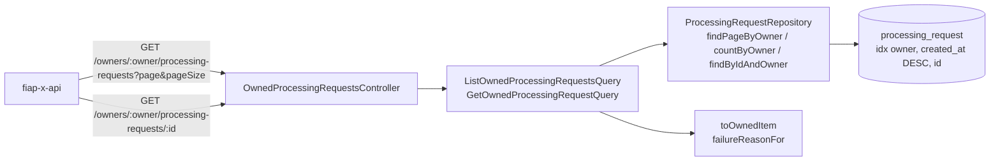

# Auth and Owner Scope Design — catalog

**Spec**: `.specs/features/auth-owner-scope/spec.md`
**Context**: `fiap-x-platform/.specs/features/auth-owner-scope/context.md`
**Status**: Draft

---

## Project decisions this design conforms to

| Decision | How this design conforms |
| --- | --- |
| **AD-001** — services separated by responsibility | The Catalog owns the data and the filter; it neither validates tokens nor shapes the user contract |
| **AD-003** — local DTOs, no shared package | The owner-scoped response is declared here; the API re-declares its own copy |
| **AD-009** — TypeORM, schema changes only through migrations | The new index is a versioned migration; `synchronize` stays off |
| **AD-013** — row locks on lifecycle writes | Untouched: these are reads, and they take no locks |

**No new project-level decision is proposed.** There is no architectural alternative worth presenting: the filter is a repository query and the routes carry the owner, both fixed by the spec.

---

## Architecture Overview



The owner is part of every repository method's signature. There is no method that lists without one, so an unscoped read cannot be written by accident, only by adding a new method.

---

## Code Reuse Analysis

### Existing Components to Leverage

| Component | Location | How to Use |
| --- | --- | --- |
| `ProcessingRequestRepository` port | `src/domain/processing-request.repository.ts` | Add three owner-scoped read methods |
| `TypeOrmProcessingRequestRepository` | `src/infrastructure/persistence/typeorm-processing-request.repository.ts` | Implement them with the manager it already holds; `toDomain` reused |
| `InMemoryProcessingRequestRepository` | `src/infrastructure/in-memory-processing-request.repository.ts` | Implement the same filter and order so unit tests exercise isolation |
| `failureReasonFor` | `src/domain/failure-reason.ts:13` | The single source of the safe sentence, already used by the terminal event |
| Controller + DTO validation style | `src/interface/create-processing-request.controller.ts` | Same explicit validation and `BadRequestException` messages |
| Migration pattern, `IF NOT EXISTS` | `src/infrastructure/persistence/migrations/1789953000000-CreateProcessingRequest.ts` | New migration adds the composite index idempotently |

### Integration Points

| System | Integration Method |
| --- | --- |
| `fiap-x-api` | HTTP on the internal network; the API is the only caller |
| PostgreSQL | Two parameterised queries per page (rows + count) and one per read |
| `fiap-x-platform` `db/create-database.sql` | Generated from this service's migrations by `scripts/generate-db-script.mjs`; regenerated in the platform's tasks after this migration lands |

---

## Components

### Repository additions

- **Location**: port `src/domain/processing-request.repository.ts`; implementations in `typeorm-processing-request.repository.ts` and `in-memory-processing-request.repository.ts`
- **Interfaces**:
  - `findPageByOwner(ownerUserId: string, offset: number, limit: number): Promise<ProcessingRequest[]>` — `WHERE owner_user_id = $1 ORDER BY created_at DESC, processing_request_id ASC OFFSET $2 LIMIT $3`
  - `countByOwner(ownerUserId: string): Promise<number>` — `WHERE owner_user_id = $1`
  - `findByIdAndOwner(processingRequestId: string, ownerUserId: string): Promise<ProcessingRequest | undefined>` — both in one `WHERE` (AC P2.4)
- **Notes**: The TypeORM version uses `find`/`count` with `where: { ownerUserId }` and `order: { createdAt: 'DESC', processingRequestId: 'ASC' }`; never a load-then-filter (AC P1.2).

### ListOwnedProcessingRequestsQuery / GetOwnedProcessingRequestQuery

- **Location**: `src/application/list-owned-processing-requests.query.ts`, `src/application/get-owned-processing-request.query.ts`
- **Interfaces**:
  - `execute({ ownerUserId, page, pageSize }): Promise<OwnedPage>`
  - `execute({ ownerUserId, processingRequestId }): Promise<OwnedItem | undefined>`
- **Notes**: Reads through the injected repository directly, not a unit of work: no write, no lock, no transaction needed. `offset = (page - 1) * pageSize`.

### toOwnedItem

- **Location**: `src/application/owned-item.ts`
- **Interfaces**: `toOwnedItem(request: ProcessingRequest): OwnedItem`
- **Notes**: Builds the item from an allow-list: `processingRequestId`, `status`, `createdAt`/`updatedAt` as ISO strings, and `failureReason = failureReasonFor(failureCode)` only when `status === FAILED` (AC P1.5, P1.6).

### OwnedProcessingRequestsController

- **Location**: `src/interface/owned-processing-requests.controller.ts`, registered unconditionally in `src/app.module.ts` (AC P1.9), unlike `ProcessingRequestObservationController`
- **Routes**:
  - `GET /owners/:ownerUserId/processing-requests` — validates the trimmed owner (`400` if blank), `page` ≥ 1 and `pageSize` 1–100 (`400` naming the parameter), then the query
  - `GET /owners/:ownerUserId/processing-requests/:id` — a non-UUID id returns `404` **before** querying (the column is `uuid`; PostgreSQL would reject the cast with an error, which must not become a `500`); otherwise `findByIdAndOwner`, `404` when absent
- **Notes**: The `404` body is one constant for every miss, so another owner's id, a random id and a malformed id are indistinguishable (AC P2.2, P2.3).

---

## Data Models

```typescript
interface OwnedItem {
  processingRequestId: string
  status: ProcessingRequestStatus
  createdAt: string   // ISO 8601
  updatedAt: string
  failureReason?: string   // present iff status === FAILED
}
interface OwnedPage { items: OwnedItem[]; page: number; pageSize: number; total: number }
```

### Migration `1789955000000-IndexProcessingRequestOwnerCreatedAt`

```sql
CREATE INDEX IF NOT EXISTS idx_processing_request_owner_created
  ON processing_request (owner_user_id, created_at DESC, processing_request_id);
```

The existing `idx_processing_request_owner` (owner only) serves the count but not the ordered page; the composite index serves both, so the old one is dropped in the same migration (`DROP INDEX IF EXISTS idx_processing_request_owner`), and `down()` restores it.

---

## Error Handling Strategy

| Error Scenario | Handling | Caller sees |
| --- | --- | --- |
| Blank owner | `BadRequestException('ownerUserId is required')` | `400`, repository not queried |
| `page`/`pageSize` invalid | `BadRequestException` naming the parameter and its range | `400` |
| Id not a UUID | `NotFoundException(<constant body>)` before the query | `404` |
| Id of another owner / unknown id | `findByIdAndOwner` → `undefined` → the same `404` | `404` |
| Database unreachable | Propagates → `500` | The API maps any non-OK to `502` |

---

## Risks & Concerns

| Concern | Location (file:line) | Impact | Mitigation |
| --- | --- | --- | --- |
| **`uuid` column rejects malformed ids with a database error** | `src/infrastructure/persistence/processing-request.entity.ts:9` | `GET …/processing-requests/abc` would be a `500`, and an oracle distinguishing malformed from missing | Validate the UUID shape in the controller and answer the constant `404` before querying |
| **Owner-only index cannot serve the ordered page** | migration `1789953000000:32-33` | A sort per request once an owner has many rows | Composite index in a new migration |
| **The generated database script drifts** | `fiap-x-platform/db/create-database.sql` (V10: no CI check) | The deliverable script would lack the new index | Regenerated in the platform's S5 tasks; V10 remains open |
| **Unscoped observation endpoint stays** | `src/interface/processing-request-observation.controller.ts` | Returns any request to anyone — but only when `LOCAL_INTEGRATION=true` | Unchanged by design (spec Out of Scope); a composition test asserts it is absent when the flag is unset, while the owned controller is present |
| **The in-memory fallback** | `src/app.module.ts` (no `DATABASE_HOST` → in-memory) | Owner filtering could be correct in memory and wrong in SQL | Isolation is asserted against PostgreSQL in e2e (CI runs Postgres since V1), not only in unit tests |

---

## Tech Decisions (only non-obvious ones)

| Decision | Choice | Rationale |
| --- | --- | --- |
| Order tiebreak | `processing_request_id ASC` after `created_at DESC` | Makes the order total, so offset pages neither repeat nor skip rows that share a timestamp |
| Reads without a transaction | Direct repository reads | Nothing to make atomic; a transaction would only hold a connection longer |
| Owner in the path | `/owners/:ownerUserId/...` | Fixed by the spec; the routes cannot be confused with the local-only `/processing-requests/:id` |
