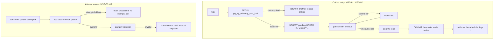

# Catalog Messaging Hardening Design — catalog

**Spec**: `.specs/features/catalog-messaging-hardening/spec.md`
**Context**: `.specs/features/catalog-messaging-hardening/context.md`
**Status**: Draft

---

## Architecture Overview

Four independent changes, all inside the existing layers. None changes an event contract.

### Approach for MSG-01: one drainer at a time

Two ways to stop replicas from publishing the same rows:

| Approach | Verdict |
| --- | --- |
| **Transaction-scoped advisory lock (`pg_try_advisory_xact_lock`)**: only the replica that takes the lock drains; the others skip the tick | **Chosen.** Global `ORDER BY id` is kept, so per-request order holds exactly as with one replica (MSG-01 AC2). Throughput is not the constraint: one drainer already publishes about 50 rows per second |
| `SELECT … FOR UPDATE SKIP LOCKED` per batch | Rejected. Replica B takes rows 51–100 while A still holds 1–50, so a request's later event can reach the broker before its earlier one. That breaks MSG-01 AC2, and AD-013 tolerates only the Started/Completed order |

The lock is released automatically when the transaction ends, including on a crash. There is no lock table to clean up.

---

## Code Reuse Analysis

### Existing Components to Leverage

| Component | Location | How to Use |
| --- | --- | --- |
| `OutboxRelay.drain` | `src/infrastructure/messaging/outbox-relay.ts:33` | Wrapped in a transaction that takes the advisory lock; publishes through the same connection |
| `OutboxRelayScheduler.tick` | `src/infrastructure/messaging/outbox-relay.scheduler.ts:58` | Already logs a failed drain and keeps the interval alive, so a rethrown timeout needs no change there |
| `amqp-connection-manager` publish `timeout` option | `node_modules/amqp-connection-manager/dist/types/ChannelWrapper.d.ts:26-32` | `sendToQueue(queue, msg, { timeout })` rejects, and removes the message from the wrapper's buffer, when it is not confirmed in time. Without the option, a publish while disconnected waits forever (V5) |
| `retryBackoffMs` | `src/infrastructure/rabbitmq/settle-failed-message.ts:5` | Treats empty or whitespace input as unset (MSG-06) |
| `findForUpdate`, `markEventProcessed` | Repository port | Stale-attempt no-op inside the existing transaction |
| `create-processing-request.controller.ts` `validateDto` | spec B | Length rules added per field (MSG-08) |

### Integration Points

| System | Integration Method |
| --- | --- |
| PostgreSQL | Advisory lock key: a constant `bigint` derived from `'catalog.outbox-relay'`, documented in the code |
| RabbitMQ | Publish `timeout`: `OUTBOX_PUBLISH_TIMEOUT_MS`, default 5000 |
| Jest | `test/jest-e2e.json` gains `globalSetup` and `setupFiles` (MSG-07) |

---

## Components

### `OutboxRelay.drain` (MSG-01, MSG-02)

- **Change**: runs in `dataSource.transaction(...)`.
  - It first takes `SELECT pg_try_advisory_xact_lock($1) AS locked`. If not acquired, it returns `0`.
  - For each row, it publishes with the timeout, then marks the row sent.
  - On the first failure it stops, lets the transaction commit the marks made so far, and rethrows after the commit. Rows already confirmed are not republished, and the failed row stays pending.
- **Interface**: `drain(batchSize = 50): Promise<number>`, unchanged.
- **Tests**: PostgreSQL e2e.
  - Two relays, with two data sources, drain 100 rows through a counting publisher. Each id is published exactly once, and per-request order holds.
  - A publisher that rejects with a timeout on row 3 leaves rows 1–2 marked and row 3 onward pending. The next drain publishes them.

### `RabbitMQConnection.sendToQueue` (MSG-02)

- **Change**: passes `{ timeout: outboxPublishTimeoutMs() }`. The parser treats blank or invalid values as 5000, the same rule as MSG-06.
- **Test**: unit with a fake channel wrapper that asserts the option is passed. The real timeout is proven by the relay e2e through an injected publisher that never resolves, plus a fake clock.

### Attempt events (MSG-03, MSG-04, MSG-05)

- **Consumers**:
  - `processing-completed.consumer.ts` requires and parses `attemptId`; a missing one is a domain error, which goes to the DLQ.
  - `processing-started.consumer.ts` and `processing-failed.consumer.ts` already parse it.
  - `video-rejected.consumer.ts` passes `origin: 'validation'`; `processing-failed.consumer.ts` passes `origin: 'processing'` with the `attemptId`.
- **Use cases**:
  - `StartProcessingRequestUseCase`, `CompleteProcessingRequestUseCase` and the processing branch of `FailProcessingRequestUseCase` compare `input.attemptId` with `request.attemptId` after `findForUpdate`.
  - On a mismatch they `markEventProcessed(eventId, id)` and return the request unchanged, with no outbox entry. The check runs **before** the AD-013 no-op branches.
- **Domain**:
  - `rejectProcessingRequest(request, code)` is allowed only from `RECEIVED`.
  - `failProcessingRequest` is allowed only from `QUEUED` and `PROCESSING`.
  - `FAILABLE_STATUSES` is split accordingly, and both raise `ProcessingRequestDomainError` otherwise.
- **Input**: `FailProcessingRequestInput` gains `origin: 'validation' | 'processing'` and `attemptId?`.

### `retryBackoffMs` (MSG-06)

- **Change**: `raw?.trim() === ''` or unset → 1000; `Number` finite and ≥ 0 → that value; otherwise 1000.

### e2e database (MSG-07)

- **`test/support/e2e-database.setup.ts`** (a `setupFiles` entry, which runs in each worker before any suite):
  - With `DATABASE_HOST` set and `DATABASE_NAME` unset, it sets `DATABASE_NAME=fiapx_e2e`.
  - If `DATABASE_NAME` is `fiapx`, it throws: "e2e suites must not run against the stack's database (DATABASE_NAME=fiapx)".
- **`test/support/e2e-database.global-setup.ts`** (`globalSetup`):
  - With `DATABASE_HOST` set, it connects as `DATABASE_ADMIN_USER`/`DATABASE_ADMIN_PASSWORD` (default `postgres`/`postgres`, the CI service's credentials).
  - It runs `CREATE DATABASE fiapx_e2e OWNER catalog` when absent.
  - In that database it runs `CREATE SCHEMA IF NOT EXISTS catalog AUTHORIZATION catalog`. Migrations then run as `catalog`, as they do now.
- **Suites that hard-code `fiapx`**: none should. The implementer greps and lists every hit.
- **CI**: unchanged. The service's `fiapx` database is no longer used by the suites, and `fiapx_e2e` is created by the global setup.

### `validateDto` bounds (MSG-08) and V39 tests (MSG-09)

- **Bounds**: `ownerUserId` at most 255 and `sourceStorageKey` at most 1024, both checked after the blank check and within each field's own sequence.
- **V39 tests**:
  - A cross-field test, for example `{ownerUserId: 42, idempotencyKey: 'x'.repeat(256)}` → `ownerUserId must be a string`.
  - A unit test where the re-read after `DuplicateSourceError` returns `undefined` → the original error is rethrown. The same test covers the key branch.
  - PostgreSQL e2e tests for the `409` with an existing new source, and for the `NULL`-key replay.

---

## Error Handling Strategy

| Error Scenario | Handling | Impact |
| --- | --- | --- |
| Another replica holds the relay lock | `drain` returns 0 | The other replica publishes; no duplicate |
| Broker silent for longer than the timeout | Publish rejects; the marks so far commit; the error is rethrown and logged | The row stays pending; the next tick retries |
| Relay crashes between publish and commit | Transaction rolls back, so those marks are lost | The same rows are republished and consumers dedupe (AD-010, unchanged) |
| Stale `attemptId` | No-op, recorded, acked | Request unchanged |
| Invalid transition | Domain error, nack without requeue | DLQ; request unchanged |

---

## Risks & Concerns

| Concern | Location | Impact | Mitigation |
| --- | --- | --- | --- |
| Holding a transaction open while publishing | `outbox-relay.ts` | A batch of 50 slow publishes holds the transaction up to 50 × timeout | Only the lock and row marks are held; the batch stops at the first timeout. Documented beside the constant |
| `pg_try_advisory_xact_lock` key collision | Relay | Another component using the same key would block the relay | One documented constant; nothing else in the schema uses advisory locks |
| `setupFiles` vs suites that build their own data source | `test/*.e2e-spec.ts` | A suite reading `DATABASE_NAME` before the setup ran | `setupFiles` runs before every test file; the implementer greps for `'fiapx'` literals |
| The stale-attempt check placed after AD-013's no-ops | Use cases | A stale Completed could be taken as a no-op restatement | The check comes first; a test sends a stale Completed with the stored key |

---

## Tech Decisions

| Decision | Choice | Rationale |
| --- | --- | --- |
| Single drainer | Transaction-scoped advisory lock | Keeps global order; no schema change; self-releasing |
| Publish timeout | `amqp-connection-manager`'s own `timeout` option | It also removes the buffered message, so a timed-out publish is not sent later behind the retry |
| e2e isolation | `setupFiles` default and guard, `globalSetup` creation | Per-worker env is reliable; creation happens once |
