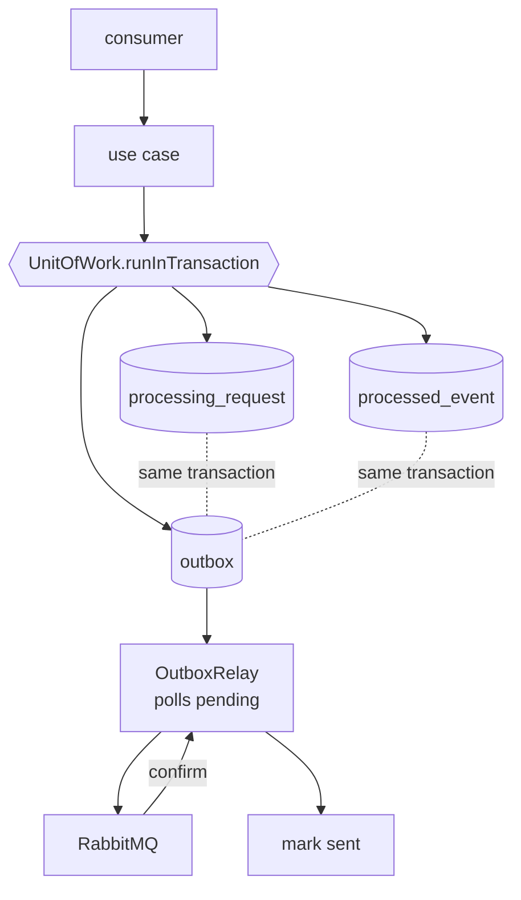

# Durable Persistence Design

**Spec**: `.specs/features/durable-persistence/spec.md`
**Status**: Draft

---

## Architecture Overview

Two changes that must land together. The repository stops being an in-memory map and becomes PostgreSQL, which makes every call asynchronous. And publication stops happening beside the state change and starts happening from a table written inside the same transaction.



The transaction boundary moves into the use case. Today each use case writes state and then publishes; afterwards it asks the unit of work for a transaction, writes the state, the deduplication record and the outbox row inside it, and publishes nothing. The relay is the only thing that talks to the broker.

**Delivery becomes at-least-once.** The relay can crash between the broker confirming and the row being marked sent, so the same event is published twice. Consumers already deduplicate by `eventId`, and losing an event is the failure this slice exists to remove — so a repeat is the right trade.

---

## Code Reuse Analysis

### Existing Components to Leverage

| Component | Location | How to Use |
| --- | --- | --- |
| Pure domain transitions | `src/domain/processing-request.ts` | Unchanged. They take a request and return one; nothing about them is I/O |
| Repository port | `src/domain/processing-request.repository.ts` | Same six methods, every one returning a promise |
| In-memory adapter | `src/infrastructure/in-memory-processing-request.repository.ts` | Kept, made async. It stays the unit-test adapter, so the fast suite stays fast |
| Use-case shape | `src/application/*.use-case.ts` | The eight-step body survives; steps 2 through 6 move inside a transaction callback |
| Queue declaration | `src/infrastructure/rabbitmq/rabbitmq.connection.ts` | `RABBITMQ_QUEUES` gains dead-letter arguments; `queue-declaration.spec.ts` keeps guarding it |
| Health endpoint | `src/interface/health.controller.ts` | Gains a database indicator beside the broker one |

### Integration Points

| System | Integration Method |
| --- | --- |
| PostgreSQL | TypeORM data source, one schema owned by this service |
| RabbitMQ | Unchanged from the consumer side; publication now originates in the relay |
| `fiap-x-platform` | Provides the database service and generates the creation deliverable from these migrations |

---

## Components

### `UnitOfWork` port

- **Purpose**: Run a piece of work with a repository and an outbox bound to one transaction.
- **Location**: `src/application/unit-of-work.ts`
- **Interfaces**: `runInTransaction<T>(work: (ctx: TransactionContext) => Promise<T>): Promise<T>` where the context carries `requests: ProcessingRequestRepository` and `outbox: OutboxWriter`
- **Dependencies**: none in the port
- **Reuses**: the existing repository port shape, now scoped to a transaction

Passing the repository **through the context** rather than injecting it is what makes the guarantee real: a use case cannot accidentally write through a connection outside the transaction, because inside the callback it only has the scoped one.

### `TypeOrmUnitOfWork`

- **Purpose**: Real transaction over the TypeORM data source.
- **Location**: `src/infrastructure/persistence/typeorm-unit-of-work.ts`
- **Interfaces**: implements `UnitOfWork`, committing on resolve and rolling back on throw
- **Dependencies**: `DataSource`
- **Reuses**: TypeORM's transaction manager

### `InMemoryUnitOfWork`

- **Purpose**: Keep unit tests free of a database.
- **Location**: `src/infrastructure/in-memory-unit-of-work.ts`
- **Interfaces**: implements `UnitOfWork` by invoking the work directly
- **Dependencies**: the in-memory repository and an in-memory outbox

It does **not** simulate rollback. A unit test asserting that a failure leaves nothing behind would pass for the wrong reason, so atomicity is asserted against PostgreSQL in the integration suite and this limitation is stated in the tasks.

### `OutboxWriter` and `OutboxRelay`

- **Purpose**: Record an event to publish; then publish pending records and mark them sent.
- **Location**: `src/application/outbox.ts`, `src/infrastructure/messaging/outbox-relay.ts`
- **Interfaces**: `add(queue, pattern, payload)`; the relay polls, publishes, and marks sent after the broker confirms
- **Dependencies**: `RabbitMQConnection`, the outbox repository
- **Reuses**: `sendToQueue` on the existing connection

### Database health indicator

- **Purpose**: Make readiness reflect the database.
- **Location**: `src/infrastructure/persistence/database.health-indicator.ts`
- **Interfaces**: same shape as the existing RabbitMQ indicator
- **Dependencies**: `DataSource`
- **Reuses**: `rabbitmq.health-indicator.ts` as the template

---

## Data Models

```sql
processing_request (
  processing_request_id uuid primary key,
  owner_user_id         text        not null,
  source_storage_key    text        not null,
  status                text        not null,
  attempt_id            uuid        null,
  zip_storage_key       text        null,
  failure_code          text        null,
  created_at            timestamptz not null,
  updated_at            timestamptz not null
)

processed_event (
  event_id              uuid primary key,
  processing_request_id uuid        null references processing_request,
  processed_at          timestamptz not null
)

outbox (
  id            bigserial primary key,
  queue         text        not null,
  pattern       text        not null,
  payload       jsonb       not null,
  created_at    timestamptz not null,
  published_at  timestamptz null
)
```

**Relationships**: `processed_event.event_id` as the primary key is what makes deduplication a schema guarantee rather than an application convention — two replicas racing the same event produce one row and one rejection. `outbox.published_at` being null is the definition of pending; an index on it keeps the relay's poll cheap.

---

## Error Handling Strategy

| Error Scenario | Handling | User Impact |
| --- | --- | --- |
| Forbidden transition | The domain throws inside the transaction, which rolls back | No state, no deduplication row, no outbox row - the message nacks without requeue |
| Duplicate `eventId` | The use case short-circuits before opening a transaction; a concurrent race is caught by the primary key and treated as already processed | One effect per event, whichever replica wins |
| Database unreachable | Readiness reports not-ready; consumers nack with requeue | Messages wait rather than being dropped |
| Broker unreachable | Transitions still commit; outbox rows accumulate as pending | Nothing is lost; events flow when the broker returns |
| Relay crashes after publishing, before marking sent | The row is published again on the next poll | The consumer's `eventId` deduplication absorbs it |
| A message keeps failing | Dead-lettered after the configured limit | The main queue keeps moving |

---

## Risks & Concerns

| Concern | Location (file:line) | Impact | Mitigation |
| --- | --- | --- | --- |
| The repository port is synchronous, so the move ripples through nine production files and their suites | `src/domain/processing-request.repository.ts:3` | A large mechanical change landing at once, with the real risk of a missed `await` reading as a value | The port changes first, in its own task, so the compiler lists every call site. `typecheck` now runs in CI, which is exactly the gate that catches a forgotten `await` returning a promise where a value is expected |
| `InMemoryUnitOfWork` cannot roll back | `src/infrastructure/in-memory-unit-of-work.ts` | A unit test asserting atomicity would pass without proving anything | Atomicity is asserted only in the PostgreSQL integration suite. The in-memory class documents the limitation, and the tasks forbid an atomicity assertion at the unit layer |
| Publication moves from the use case to the relay, so an event is no longer published by the time `execute` returns | `src/application/*.use-case.ts` | Existing assertions that a use case published something become assertions about the outbox instead | Deliberate and named in the tasks: they assert a pending row, and the integration suite asserts the event reaches the broker |
| Delivery becomes at-least-once where the code previously published once | `src/infrastructure/messaging/outbox-relay.ts` | A consumer without deduplication would double-apply | Every consumer already deduplicates by `eventId`, and S2 covered that with tests. The relay's retry is safe because of work already done |
| An unindexed poll over a growing outbox degrades quietly | `outbox` table | The relay slows as the table grows, with no error | A partial index on pending rows, and the pending count and oldest-age exposed so degradation is visible rather than inferred |

> Lessons note: `.specs/LESSONS.md` holds only `candidate` entries, which the skill's rule says not to load as guidance. `L-001` there - add a characterization test for an edge case documented as unreachable - is nonetheless the instinct behind asserting that a rolled-back transaction leaves no `processed_event` row.

---

## Tech Decisions (only non-obvious ones)

| Decision | Choice | Rationale |
| --- | --- | --- |
| ORM | TypeORM | It is what the C4 code diagram in the modelling board names, so the implementation matches the documented design. `foudation.md` does not name one, which is why this is recorded here rather than assumed |
| Where the transaction is opened | In the use case, through `UnitOfWork` | The transition and its event are one business fact. Opening it in the consumer would put transport in charge of a domain boundary; opening it in the repository would make a single write the unit, which is exactly what this slice is fixing |
| How the scoped repository reaches the work | Passed in the transaction context | Injection would leave a second, unscoped repository reachable from inside the callback - a silent way to write outside the transaction |
| Publication ownership | Only the relay publishes | If a use case could also publish, there would be two paths to the broker and the outbox would stop being the record of what was sent |
| Polling rather than listening | A polled relay | `LISTEN/NOTIFY` is faster to react but adds a second failure mode, and a poll that finds nothing is nearly free with the partial index |
| Marking sent after the confirm | After | Marking first turns a broker failure into a silently dropped event, which is the loss this slice removes |
| Keeping the in-memory adapter | Kept | Unit tests stay fast and free of a container; the PostgreSQL adapter is proven where it matters, against PostgreSQL |

> **Project-level decisions:** the ORM choice and the outbox-owns-publication rule are conventions future features must follow. Both should be appended to `.specs/STATE.md` as a new `AD-NNN` when this design is approved.
