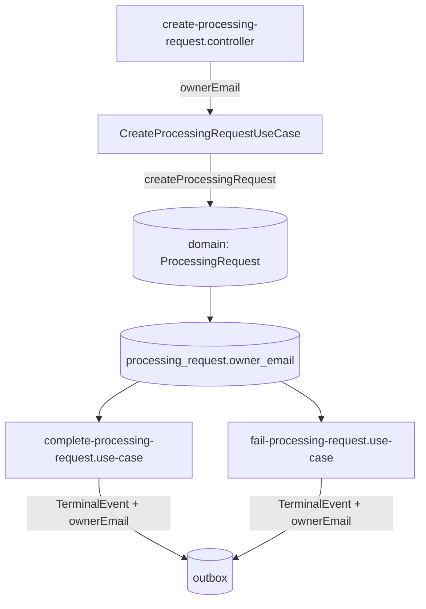

# Email Notification — Catalog Design

**Spec**: `.specs/features/email-notification/spec.md`
**Status**: Draft

---

## Architecture Overview

One field, added at the one place `ProcessingRequest` is created, read back at the two places a terminal event is built. No new table, no new port.



`VideoValidationRequestedEvent` (built in `create-processing-request.use-case.ts`) is untouched — it does not carry `ownerEmail`, on purpose.

---

## Code Reuse Analysis

### Existing Components to Leverage

| Component | Location | How to Use |
| --- | --- | --- |
| `createProcessingRequest` | `src/domain/processing-request.ts` | Gains one required input field, validated the same way as `ownerUserId` |
| `CreateProcessingRequestUseCase` | `src/application/create-processing-request.use-case.ts` | Passes `ownerEmail` through to the domain factory; replay path unchanged (it already ignores most of a replay's body) |
| `CreateProcessingRequestDto` / controller | `src/interface/create-processing-request.dto.ts`, `.../create-processing-request.controller.ts` | Gains one field, validated with the existing `requireString` helper |
| `ProcessingRequestEntity` + migrations | `src/infrastructure/persistence/processing-request.entity.ts` | Gains one `NOT NULL text` column; new migration, following `1789953100000-CreateOutbox.ts`'s naming pattern |
| `complete-processing-request.use-case.ts`, `fail-processing-request.use-case.ts` | `src/application/` | Both outbox-building call sites add `ownerEmail: updated.ownerEmail` to the `TerminalEvent` payload |
| `TerminalEventDto` (messaging) | `src/messaging/dto/terminal-event.dto.ts` | Gains the field |

### Integration Points

| System | Integration Method |
| --- | --- |
| `fiap-x-api` | Same `POST /processing-requests` body, one more field |
| `notification-service` | Same `terminal.event` message, one more field, additive |
| PostgreSQL | One new column via TypeORM migration |

---

## Components

### `ProcessingRequest` domain interface + `createProcessingRequest`

- **Purpose**: Hold and validate the email the same way as the other required strings.
- **Location**: `src/domain/processing-request.ts`
- **Interfaces**: `ProcessingRequest.ownerEmail: string`; `CreateProcessingRequestInput.ownerEmail: string`
- **Reuses**: the existing `ProcessingRequestDomainError` and the blank-check pattern already applied to `ownerUserId`/`sourceStorageKey`

### `ProcessingRequestEntity` + migration

- **Purpose**: Persist it.
- **Location**: `src/infrastructure/persistence/processing-request.entity.ts`, new file under `src/infrastructure/persistence/migrations/`
- **Interfaces**: `@Column({ name: 'owner_email', type: 'text' }) ownerEmail: string;`
- **Reuses**: the mapping already done in `TypeOrmProcessingRequestRepository` between entity and domain object — one more field on both sides of that mapping

### `CreateProcessingRequestDto` / controller

- **Purpose**: Accept and validate the field at the HTTP boundary.
- **Location**: `src/interface/create-processing-request.dto.ts`, `.../create-processing-request.controller.ts`
- **Reuses**: `requireString(dto, 'ownerEmail', MAX_OWNER_EMAIL_LENGTH)`, the same helper already used for the other three fields

### `complete-processing-request.use-case.ts`, `fail-processing-request.use-case.ts`

- **Purpose**: Add `ownerEmail` to the one event that needs it.
- **Location**: as named
- **Reuses**: the existing outbox-add call; one more object key, read from the already-loaded `updated` aggregate

---

## Data Models

```sql
-- processing_request, new column
owner_email text not null
```

**Relationships**: none new. `owner_email` lives on the same row as every other field of this aggregate; no new table, no new index (it is never queried by, only read from, the existing row).

---

## Error Handling Strategy

| Error Scenario | Handling | User Impact |
| --- | --- | --- |
| `ownerEmail` missing or blank at creation | `ProcessingRequestDomainError`, mapped by the controller to `400`, same as the existing fields | Same failure shape the API already forwards for a missing `ownerUserId` |
| `ownerEmail` present but exceeds the bounded length | Same as above | Same |
| A replay's body carries a different `ownerEmail` than the stored request | Ignored; the stored value is returned unchanged | No error — matches how a replay already treats `sourceStorageKey` |

---

## Risks & Concerns

| Concern | Location (file:line) | Impact | Mitigation |
| --- | --- | --- | --- |
| A future event route accidentally copies `ownerEmail` onto `VideoValidationRequested` or `ProcessingQueued` by reusing the terminal event's object literal as a starting point | `create-processing-request.use-case.ts`, `start-processing-request.use-case.ts` | Widens PII surface to the Worker for no reason, undoing the whole point of AD-015's "terminal event only" scoping | A test asserts the exact key set of each non-terminal event's outbox payload, so an added field fails it by name |
| `db/create-database.sql` (generated in `fiap-x-platform`) drifts from this migration | `fiap-x-platform/scripts/generate-db-script.mjs` | The platform repo's `--check` gate already catches this; no new risk, just a reminder that regenerating it is part of this slice's task list, not optional | Existing `--check` gate |

> Lessons note: no confirmed lessons in `.specs/LESSONS.md` yet; nothing to load as guidance.

---

## Tech Decisions (only non-obvious ones)

| Decision | Choice | Rationale |
| --- | --- | --- |
| `NOT NULL` vs. nullable column | `NOT NULL` | No legacy rows in this local-dev system; nullable-with-legacy-caveat (as `idempotency_key` needed) would be complexity this slice doesn't need |
| Where the field is added on the outbox payload | Object literal at the two terminal call sites, not a shared builder | Two call sites, one field each; a shared builder would be an abstraction for a duplication that doesn't exist yet |

> **Project-level decisions:** AD-015 is recorded in `fiap-x-platform/.specs/STATE.md` once implementation lands; this document only implements the part of it that is this repository's responsibility.
