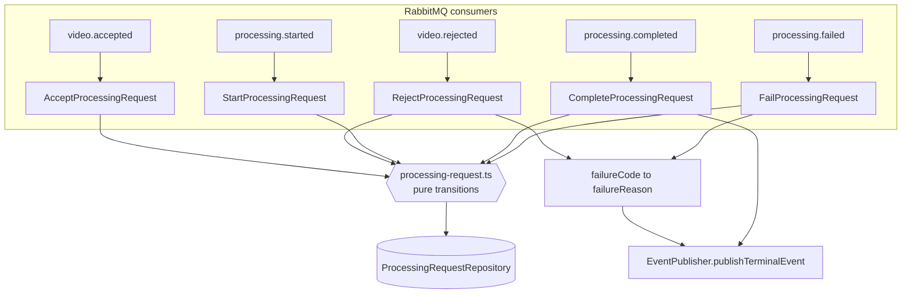
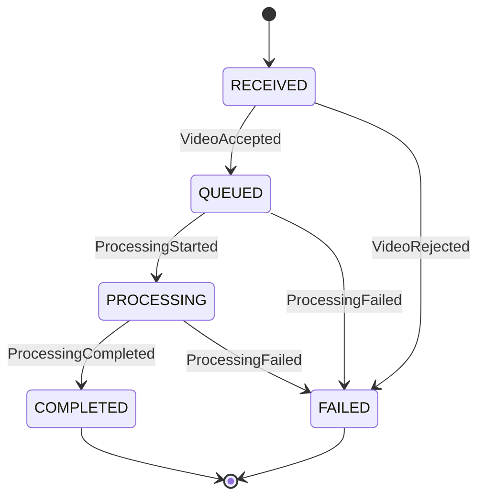

# Full Lifecycle Design

**Spec**: `.specs/features/full-lifecycle/spec.md`
**Status**: Draft

---

## Architecture Overview

The shape already in the repository is the right one: a pure-function domain module, one use case per transition, one consumer per inbound event, and a single `EventPublisher` port. This slice does not introduce a new pattern — it completes the existing one by adding the two missing transitions, the three missing consumers, and the failure half of the terminal contract.



**State machine after this slice:**



`COMPLETED` becomes reachable only from `PROCESSING`. That is a deliberate tightening of today's behaviour and is called out under Risks.

---

## Code Reuse Analysis

### Existing Components to Leverage

| Component | Location | How to Use |
| --- | --- | --- |
| Pure transition functions | `src/domain/processing-request.ts` | Add `startProcessingRequest` and `failProcessingRequest` beside `acceptProcessingRequest`, same signature shape: take the request, return a new one, throw `ProcessingRequestDomainError` on a forbidden transition |
| Use case template | `src/application/accept-processing-request.use-case.ts` | Copy its structure verbatim: validate input, check `hasEventBeenProcessed`, load, transition, persist, publish, mark processed |
| Deduplication | `ProcessingRequestRepository.hasEventBeenProcessed` / `markEventProcessed` | Already the idempotency mechanism; the new use cases reuse it rather than inventing one |
| Consumer template | `src/infrastructure/rabbitmq/video-accepted.consumer.ts` | Same shape: parse, unwrap a `data` envelope, delegate, ack on success, nack with `requeue = !(err instanceof ProcessingRequestDomainError)` |
| Publisher port | `src/application/event-publisher.ts` | `publishTerminalEvent` already exists; only its DTO changes |
| Test double | `test/local-docker-integration.e2e-spec.ts` `FakeRabbitMQConnection` | Already contract-checked through `RabbitMQConnectionContract`; the new consumers are driven through its `deliver()` |

### Integration Points

| System | Integration Method |
| --- | --- |
| Processing Worker | Consumes three new queues it will publish to: `video.rejected`, `processing.started`, `processing.failed` |
| Notification Service | Receives the widened terminal event. Its `TerminalEventDto` already declares `zipStorageKey?` and `failureReason?`, so no change is required on that side |
| RabbitMQ | Three additional `channel.consume` registrations, following the two that exist |

---

## Components

### Domain: transitions

- **Purpose**: Decide, purely, whether a transition is allowed and produce the next state.
- **Location**: `src/domain/processing-request.ts`
- **Interfaces**:
  - `startProcessingRequest(request): ProcessingRequest` — `QUEUED` only
  - `failProcessingRequest(request, failureCode): ProcessingRequest` — from `RECEIVED`, `QUEUED` or `PROCESSING`
  - `completeProcessingRequest(request, zipStorageKey)` — guard tightened from `QUEUED` to `PROCESSING`
  - `FailureCode` — the closed vocabulary from the foundation
- **Dependencies**: none; the module stays free of framework and I/O
- **Reuses**: the existing throw-on-forbidden-transition convention

### Domain: failure reason mapping

- **Purpose**: Turn a `FailureCode` into the one user-facing sentence published for it.
- **Location**: `src/domain/failure-reason.ts`
- **Interfaces**: `failureReasonFor(code: FailureCode): string`
- **Dependencies**: none
- **Reuses**: nothing — it is the single origin of user-visible failure text, which is why it is a total function over a closed union rather than a lookup that can miss

### Application: `RejectProcessingRequestUseCase`, `StartProcessingRequestUseCase`, `FailProcessingRequestUseCase`

- **Purpose**: One transition each, idempotent by `eventId`, publishing what the transition requires.
- **Location**: `src/application/`
- **Interfaces**: `execute(input): Promise<ProcessingRequest>` where input carries `eventId`, `processingRequestId`, `occurredAt`, and `failureCode` for the two failing paths
- **Dependencies**: `ProcessingRequestRepository`, `EventPublisher`
- **Reuses**: `AcceptProcessingRequestUseCase` structure line for line

### Infrastructure: three consumers

- **Purpose**: Bind each new queue to its use case.
- **Location**: `src/infrastructure/rabbitmq/`
- **Interfaces**: `onModuleInit` registers `channel.consume`; `handleMessage(content)` is public so unit tests drive it without a broker
- **Dependencies**: `RabbitMQConnection`, the matching use case
- **Reuses**: `VideoAcceptedConsumer` structure, including its nack policy

---

## Data Models

```typescript
export type FailureCode =
  | 'FORMATO_INVALIDO'
  | 'DURACAO_EXCEDIDA'
  | 'PROCESSAMENTO_FALHOU'

export interface ProcessingRequest {
  // ...existing fields
  failureCode: FailureCode | undefined   // new
}

export interface TerminalEventDto {
  eventId: string
  processingRequestId: string
  ownerUserId: string
  status: ProcessingRequestStatus
  zipStorageKey?: string      // was required
  failureReason?: string      // new
  attemptId?: string
  occurredAt: string
}
```

**Relationships**: `failureCode` is stored on the aggregate; `failureReason` is derived at publication time and never persisted, so the mapping can change without a migration.

---

## Error Handling Strategy

| Error Scenario | Handling | User Impact |
| --- | --- | --- |
| Forbidden transition | Domain function throws `ProcessingRequestDomainError`; consumer nacks without requeue | The request keeps its prior state; the message is not redelivered forever |
| Unknown `failureCode` | Rejected at the use-case boundary before the domain is touched | No unknown code is ever stored or published |
| Unknown `processingRequestId` | Use case throws; consumer nacks without requeue | No request is created by an event that names a missing one |
| Duplicate `eventId` | Use case returns the existing request without transitioning or publishing | One effect per event, whatever the delivery count |
| Publication fails after persistence | Error propagates; message is not acked | The message is redelivered, and deduplication makes the retry safe |
| Technical fault, such as a broker drop | Consumer nacks **with** requeue | A transient fault is retried; a contract violation is not |

---

## Risks & Concerns

| Concern | Location (file:line) | Impact | Mitigation |
| --- | --- | --- | --- |
| Tightening completion to require `PROCESSING` changes behaviour that currently passes | `src/domain/processing-request.ts:70` | A `ProcessingCompleted` that arrives without a preceding `ProcessingStarted` now fails where it used to succeed | This is the intent of LC-02 and is named in the spec's edge cases. The Worker gains `ProcessingStarted` in the same slice, so the two land together; the e2e is updated to drive the full sequence |
| Five use cases and five consumers now repeat the same eight-step shape | `src/application/` | Drift between copies is how the Catalog's fake diverged from its connection in the CI slice | Accepted deliberately for this slice: the duplication is visible and uniform. Extracting a template before five instances exist would be speculative. Revisit when S3 rewrites these against PostgreSQL |
| `failureCode` widens the aggregate that S3 is about to persist | `src/domain/processing-request.ts` | A schema written before this field would need migrating | Exactly why this slice precedes S3 in the delivery order |
| Terminal DTO changes from required to optional `zipStorageKey` | `src/messaging/dto/terminal-event.dto.ts` | A consumer relying on it being present would break | The only consumer is the Notification Service, whose DTO already declares it optional. Verified in `notification-service/src/notifications/dtos/terminal-event.dto.ts` |

> Lessons note: `.specs/LESSONS.md` holds only `candidate` entries. Per the skill's rule, candidates are not loaded as guidance, so none were applied. `L-001` there does describe adding a characterization test for an unreachable edge case — the same instinct is served by LC-05 and LC-06, which are written as explicit ACs rather than borrowed from an unconfirmed lesson.

---

## Tech Decisions (only non-obvious ones)

| Decision | Choice | Rationale |
| --- | --- | --- |
| Where the failure reason is produced | Derived at publication, never stored | The stored `failureCode` is the fact; the sentence is presentation. Storing the text would freeze wording into data and make rewording a migration |
| `failureReason` as a function over a closed union | A total function with no default branch | A lookup with a fallback would silently publish a generic sentence for a code someone forgot to map; exhaustiveness makes the compiler catch it |
| One use case per transition | Keep the existing one-per-transition shape | Merging them behind a generic "apply transition" service would move the guard out of the aggregate, which AD-001's boundary assigns to the Catalog |
| Whether `PROCESSING` is required before `COMPLETED` | Required | Otherwise `PROCESSING` is decorative and a lost `ProcessingStarted` is indistinguishable from a normal run |
| Queue naming | `video.rejected`, `processing.started`, `processing.failed` | Matches the dotted style of `video.accepted` and `processing.completed` already in use |

> **Project-level decisions:** none here sets a new convention; each follows a pattern already established in this repository.
