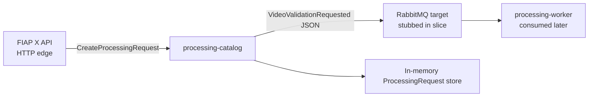

# Catalog Initial Vertical Slice Design

**Spec**: `.specs/features/initial-vertical-slice/spec.md`
**Status**: Approved

## Architecture Overview

This slice implements the first controlled lifecycle step of `ProcessingRequest` inside the Processing Catalog. The goal is to prove that the Catalog can create a request in `RECEIVED` state and publish a documented `VideoValidationRequested` JSON message, with no production database or outbox wiring yet. All persistence is in-memory and all messaging is local or stubbed, keeping RabbitMQ integration as a documented target.

## Code Reuse Analysis

### Existing Components to Leverage

| Component | Location | How to Use |
| --- | --- | --- |
| Approved service boundary | `docs/service-boundary.md` | Source of truth for what the Catalog owns and does not own. |
| Canonical event contracts | `docs/foudation.md` | Defines `VideoValidationRequested` fields and the `RECEIVED` state. |
| NestJS bootstrap | `package.json`, `nest-cli.json`, `src/main.ts` | Quality gates already pass; build on existing module structure. |

### Integration Points

| System | Integration Method |
| --- | --- |
| FIAP X API | In-process NestJS controller invocation for this slice; future slice will expose HTTP. |
| Processing Worker | Published JSON message via a stubbed event publisher that models the RabbitMQ contract. |
| RabbitMQ | Documented target only; no broker connection, exchange, or queue configuration in this slice. |
| AWS (RDS, etc.) | Out of scope; in-memory persistence replaces PostgreSQL for the slice. |

## Components

### Domain layer

- **ProcessingRequest aggregate** (`src/domain/processing-request.ts`)
  - Owns the state machine (`RECEIVED` as initial state).
  - Enforces valid transitions and required fields.
  - Generates a stable `processingRequestId`.
- **ProcessingRequest repository interface** (`src/domain/processing-request.repository.ts`)
  - Abstract port for saving and finding by `eventId`/`processingRequestId`.

### Application layer

- **CreateProcessingRequest use case** (`src/application/create-processing-request.use-case.ts`)
  - Accepts owner and source inputs.
  - Creates the aggregate, saves it, and emits `VideoValidationRequested`.
  - Guards duplicate `eventId` with no additional effect.
- **Event publisher interface** (`src/application/event-publisher.ts`)
  - Port for publishing the validation event as documented JSON.

### Infrastructure layer

- **In-memory repository** (`src/infrastructure/in-memory-processing-request.repository.ts`)
  - Implements the repository port using an in-memory map.
  - Tracks processed `eventId` values for idempotency.
- **In-memory event publisher** (`src/infrastructure/in-memory-event-publisher.ts`)
  - Records published JSON payloads for assertion in tests.

### Interface layer

- **CreateProcessingRequest controller** (`src/interface/create-processing-request.controller.ts`)
  - NestJS controller that wires the use case for the slice.
  - Validates required input using a local DTO.
- **CreateProcessingRequest DTO** (`src/interface/create-processing-request.dto.ts`)
  - Local DTO matching the fields required by the foundation spec.

## Data Models

### ProcessingRequest aggregate

| Field | Type | Notes |
| --- | --- | --- |
| `processingRequestId` | UUID | Generated by the aggregate. |
| `ownerUserId` | string | From authenticated context, passed by the API. |
| `sourceStorageKey` | string | S3 object key, not the binary. |
| `status` | enum | Initial value `RECEIVED`. |
| `createdAt` | ISO timestamp | Set at creation. |
| `updatedAt` | ISO timestamp | Set at creation. |

### VideoValidationRequested JSON

| Field | Type | Source |
| --- | --- | --- |
| `eventId` | UUID | Generated by the use case for this event. |
| `processingRequestId` | UUID | From the aggregate. |
| `ownerUserId` | string | From the aggregate. |
| `sourceStorageKey` | string | From the aggregate. |
| `occurredAt` | ISO timestamp | Creation timestamp. |

No shared contracts repository or npm package is introduced. DTOs and event shapes are local and documented.

## Error Handling Strategy

| Error Scenario | Handling | User Impact |
| --- | --- | --- |
| Missing `ownerUserId` or `sourceStorageKey` | Controller/use case reject with domain error. | No request is created and no event is emitted. |
| Repeated `eventId` | Use case returns existing result with no new state or event. | Idempotent; caller observes the same outcome. |
| Invalid status transition | Rejected by the aggregate; not reachable in this slice because only `RECEIVED` is allowed. | Request state remains unchanged. |

## Risks & Concerns

| Concern | Location | Impact | Mitigation |
| --- | --- | --- | --- |
| In-memory store is not durable | `src/infrastructure/in-memory-processing-request.repository.ts` | Data is lost on process restart. | Accepted for the slice; PostgreSQL persistence is the next planned slice. |
| No real RabbitMQ broker | `src/infrastructure/in-memory-event-publisher.ts` | Integration path is not exercised against a broker. | Publisher interface and JSON shape mirror the target broker contract, enabling swap-in later. |
| Idempotency stored in memory | use case | Duplicates survive only while the process is alive. | Sufficient for slice-level proof; durable deduplication follows with PostgreSQL. |

## Tech Decisions

| Decision | Choice | Rationale |
| --- | --- | --- |
| Persistence | In-memory repository | Proves domain behavior and gates before adding PostgreSQL/migrations/outbox. |
| Messaging | Stubbed event publisher | Models the documented RabbitMQ contract without requiring broker infrastructure. |
| DTOs/Contracts | Local TypeScript classes/interfaces | Matches the MVP decision to avoid a shared contracts repo or package. |
| Testing | Jest unit tests on use case and controller | Aligns with existing Nest gates and the requirement for independent verification. |
| Quality gates | `npm test`, `npm run lint`, `npm run build` | Already established by the NestJS bootstrap; must remain green. |
