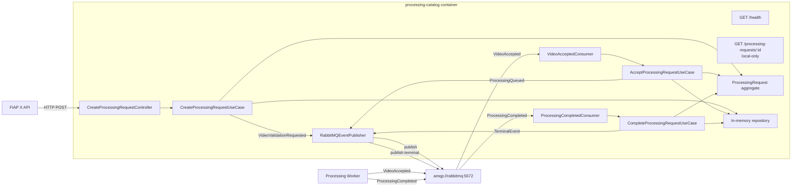

# Catalog Local Docker Integration Design

**Spec**: `.specs/features/local-docker-integration/spec.md`
**Status**: Approved
**TLC references**: `/Volumes/HIKSEMI/repository/fiap-x/fiapx/.agents/skills/tlc-spec-driven/references/design.md`, `/Volumes/HIKSEMI/repository/fiap-x/fiapx/.agents/skills/tlc-spec-driven/references/tasks.md`

## Architecture Overview

This slice connects Processing Catalog to a real RabbitMQ broker in a local Docker context. It keeps persistence in-memory (persistence is out of scope), but the messaging topology, event DTOs, and lifecycle transitions are real. The slice proves that Catalog can own `RECEIVED → QUEUED → COMPLETED` through RabbitMQ, expose a local-only observation endpoint, and report readiness based on broker connectivity.

## Code Reuse Analysis

### Existing Components to Leverage

| Component | Location | How to Use |
| --- | --- | --- |
| ProcessingRequest aggregate | `src/domain/processing-request.ts` | Extend with transition methods, `attemptId`, and rejection of invalid transitions. |
| Repository port and in-memory adapter | `src/domain/processing-request.repository.ts`, `src/infrastructure/in-memory-processing-request.repository.ts` | Extend to support request updates and event deduplication. |
| CreateProcessingRequest use case | `src/application/create-processing-request.use-case.ts` | Keep; refactor publisher call to the expanded port. |
| EventPublisher port | `src/application/event-publisher.ts` | Expand to carry all published event shapes. |
| NestJS bootstrap | `src/main.ts`, `src/app.module.ts` | Add RabbitMQ module, health module, and conditional local controller. |

### Integration Points

| System | Integration Method |
| --- | --- |
| FIAP X API | HTTP POST to existing `/processing-requests` endpoint (unchanged contract). |
| Processing Worker | RabbitMQ: publishes `VideoValidationRequested`; consumes `VideoAccepted`; publishes `ProcessingQueued`; consumes `ProcessingCompleted`; publishes terminal event. |
| RabbitMQ broker | `amqplib` via a NestJS module. One connection per container, one channel for publishing, one channel for consuming. |
| Local observation | `GET /processing-requests/:id` exposed only when `LOCAL_INTEGRATION=true`. |
| Health/readiness | `GET /health` returns 200 only when RabbitMQ connection is open. |

## Components

### Domain layer

- **ProcessingRequest aggregate** (`src/domain/processing-request.ts`)
  - Adds `attemptId: string | undefined` and `zipStorageKey: string | undefined`.
  - Adds `acceptProcessingRequest(request)`: valid only from `RECEIVED` to `QUEUED`; generates `attemptId`; returns updated request.
  - Adds `completeProcessingRequest(request, zipStorageKey)`: valid only from `QUEUED` to `COMPLETED`; stores `zipStorageKey`; returns updated request.
  - Rejects unsupported transitions by throwing `ProcessingRequestDomainError`.

- **ProcessingRequest repository interface** (`src/domain/processing-request.repository.ts`)
  - Adds `update(request: ProcessingRequest): void` for state transitions.
  - Keeps `markEventProcessed` / `hasEventBeenProcessed` for deduplication.

### Application layer

- **EventPublisher port** (`src/application/event-publisher.ts`)
  - Expands from a single `publish` method to explicit methods for each published shape:
    - `publishVideoValidationRequested(event)`
    - `publishProcessingQueued(event)`
    - `publishTerminalEvent(event)`
  - Keeps the existing in-memory publisher testable.

- **CreateProcessingRequest use case** (`src/application/create-processing-request.use-case.ts`)
  - Calls `publishVideoValidationRequested` instead of the old generic `publish`.
  - No behavioral change for the RECEIVED creation path.

- **AcceptProcessingRequest use case** (`src/application/accept-processing-request.use-case.ts`)
  - Input: `eventId`, `processingRequestId`, `occurredAt`.
  - Validates event shape and deduplicates by `eventId`.
  - Loads the request, transitions `RECEIVED → QUEUED`, generates `attemptId`, saves, marks event processed, publishes `ProcessingQueued`.
  - Rejects missing `processingRequestId` or unsupported transitions with no state change and no follow-up event.

- **CompleteProcessingRequest use case** (`src/application/complete-processing-request.use-case.ts`)
  - Input: `eventId`, `processingRequestId`, `zipStorageKey`, `occurredAt`.
  - Validates event shape and deduplicates by `eventId`.
  - Loads the request, transitions `QUEUED → COMPLETED`, saves, marks event processed, publishes terminal event.
  - Rejects missing `processingRequestId`, missing `zipStorageKey`, or unsupported transitions.

### Infrastructure layer

- **In-memory repository update** (`src/infrastructure/in-memory-processing-request.repository.ts`)
  - Implements `update` by overwriting the stored request.
  - Keeps event deduplication maps.

- **In-memory event publisher update** (`src/infrastructure/in-memory-event-publisher.ts`)
  - Records `VideoValidationRequested`, `ProcessingQueued`, and `TerminalEvent` payloads separately.
  - Provides typed accessors for tests.

- **RabbitMQ module** (`src/infrastructure/rabbitmq/`)
  - `RabbitMQModule` registers a connection provider using `amqplib` / `amqp-connection-manager`.
  - `RabbitMQConnection` wraps the connection/channel, exposes `isConnected()`, and provides the publish channel.
  - `RabbitMQEventPublisher` implements `EventPublisher` by serializing events and publishing to the configured exchange/queue.
  - `RabbitMQHealthIndicator` checks `RabbitMQConnection.isConnected()`.

- **RabbitMQ consumers** (`src/infrastructure/rabbitmq/`)
  - `VideoAcceptedConsumer` listens on the `video.accepted` queue, deserializes the message into `VideoAcceptedDto`, invokes `AcceptProcessingRequestUseCase`.
  - `ProcessingCompletedConsumer` listens on the `processing.completed` queue, deserializes into `ProcessingCompletedDto`, invokes `CompleteProcessingRequestUseCase`.
  - Both use manual acknowledgment: ack only after the use case returns; nack (with requeue) if the use case throws a retryable error. Do not ack on publication failure.

### Interface layer

- **Local-only observation controller** (`src/interface/processing-request-observation.controller.ts`)
  - `GET /processing-requests/:id` returns the current state of a request.
  - Registered only when `LOCAL_INTEGRATION=true`; absent otherwise.
  - Read-only: no side effects.

- **Health controller** (`src/interface/health.controller.ts`)
  - `GET /health` returns `{ status: 'ok', rabbitmq: 'up' }` when the broker is reachable.
  - Returns 503 with `{ status: 'error', rabbitmq: 'down' }` when RabbitMQ is unavailable.

- **Updated AppModule** (`src/app.module.ts`)
  - Imports `RabbitMQModule`.
  - Conditionally registers the observation controller via a dynamic provider factory based on `LOCAL_INTEGRATION`.
  - Registers `HealthController`.

### Container layer

- **Dockerfile** (`Dockerfile`)
  - Multi-stage build: install dependencies, build the NestJS app, copy `dist/` into a slim runtime image.
  - Exposes port 3000 and runs `node dist/main`.
  - Uses a non-root user.

- **.dockerignore**
  - Ignores `node_modules`, `dist`, `.env`, `.git`, and AppleDouble `._*` files.

## Data Models

### ProcessingRequest aggregate (extended)

| Field | Type | Notes |
| --- | --- | --- |
| `processingRequestId` | UUID | Generated at creation. |
| `ownerUserId` | string | From authenticated context. |
| `sourceStorageKey` | string | S3 object key. |
| `status` | enum | `RECEIVED` → `QUEUED` → `COMPLETED`. |
| `attemptId` | string \| undefined | Generated on `RECEIVED → QUEUED`. |
| `zipStorageKey` | string \| undefined | Set on `QUEUED → COMPLETED`. |
| `createdAt` | ISO timestamp | Set at creation. |
| `updatedAt` | ISO timestamp | Updated on every transition. |

### RabbitMQ event DTOs

| DTO | Direction | Fields |
| --- | --- | --- |
| `VideoValidationRequestedDto` | publish | `eventId`, `processingRequestId`, `ownerUserId`, `sourceStorageKey`, `occurredAt` |
| `VideoAcceptedDto` | consume | `eventId`, `processingRequestId`, `occurredAt` |
| `ProcessingQueuedDto` | publish | `eventId`, `processingRequestId`, `ownerUserId`, `sourceStorageKey`, `attemptId`, `occurredAt` |
| `ProcessingCompletedDto` | consume | `eventId`, `processingRequestId`, `zipStorageKey`, `occurredAt` |
| `TerminalEventDto` | publish | `eventId`, `processingRequestId`, `ownerUserId`, `status`, `zipStorageKey`, `occurredAt` |

All DTOs are local TypeScript classes/interfaces; no shared contracts package is introduced.

### RabbitMQ topology (local profile)

| Exchange | Type | Queue | Binding key |
| --- | --- | --- | --- |
| `fiapx.events` | topic | `video.validation.requested` | `video.validation.requested` |
| `fiapx.events` | topic | `video.accepted` | `video.accepted` |
| `fiapx.events` | topic | `processing.queued` | `processing.queued` |
| `fiapx.events` | topic | `processing.completed` | `processing.completed` |
| `fiapx.events` | topic | `processing.terminal` | `processing.terminal` |

The topology is declared idempotently at module initialization.

## Error Handling Strategy

| Error Scenario | Handling | User Impact |
| --- | --- | --- |
| Missing `processingRequestId` in consumed event | Use case throws domain error; consumer nacks without requeue (poison message). | No state change, no success event. |
| Unsupported transition | Aggregate throws `ProcessingRequestDomainError`; consumer nacks without requeue. | Prior state retained. |
| Duplicate `eventId` | Use case returns existing outcome; no new state or event. | Idempotent. |
| Publication failure | Use case propagates error; consumer does not ack the source message. | Broker can redeliver; redelivery is idempotent. |
| RabbitMQ unavailable at startup | `RabbitMQConnection` retries with exponential back-off; `/health` returns 503 until connected. | Container is not ready; orchestrator can restart. |

## Risks & Concerns

| Concern | Location | Impact | Mitigation |
| --- | --- | --- | --- |
| In-memory store still not durable | `src/infrastructure/in-memory-processing-request.repository.ts` | Process restart loses state. | Accepted; PostgreSQL slice follows. |
| Single RabbitMQ connection is a SPOF | `src/infrastructure/rabbitmq/rabbitmq.connection.ts` | Broker disconnect pauses consume and publish. | Use `amqp-connection-manager` with auto-reconnect; readiness reflects connection state. |
| No publisher confirms yet | `RabbitMQEventPublisher` | Message loss on broker failure before confirm. | Accepted for local slice; confirms added with outbox. |
| Local observation could leak in prod | `src/interface/processing-request-observation.controller.ts` | Gated by `LOCAL_INTEGRATION`; absent by default. | Environment flag is the only activation path. |

## Tech Decisions

| Decision | Choice | Rationale |
| --- | --- | --- |
| RabbitMQ client | `amqplib` + `amqp-connection-manager` | Fine-grained topology control and reconnection; keeps HTTP app unchanged. |
| Publisher port shape | Explicit methods per event | Clearer than a generic union at this slice; easy to swap in outbox later. |
| DTOs/Contracts | Local TypeScript interfaces | Matches MVP decision to avoid shared contracts package. |
| Local observation | Conditional controller registration | Keeps the endpoint out of production surface without route-level guards. |
| Health check | Dedicated `/health` controller + RabbitMQ indicator | Simple, testable, and satisfies the readiness requirement. |
| Dockerfile | Multi-stage Node.js build | Standard, small image, no secrets in layers. |

## Quality Gap Closure

This slice closes the two minor gaps left by the initial vertical slice validation:

1. **Lint warning** (`src/interface/create-processing-request.controller.spec.ts:36`): add an explicit type cast or suppress with a justified comment so `npm run lint` reports zero warnings.
2. **Unsupported transition edge case** (`src/domain/processing-request.spec.ts`): add a direct aggregate test asserting that `acceptProcessingRequest`/`completeProcessingRequest` reject invalid transitions and leave the prior state unchanged.
3. **AppleDouble exclusions**: retained in `.gitignore`, `eslint.config.mjs`, and Jest configs without runtime change.
