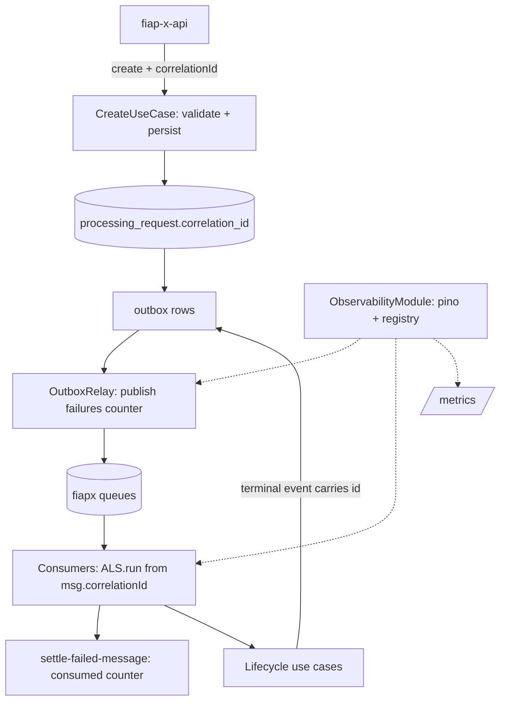

# Observability Design — Processing Catalog

**Spec**: `.specs/features/observability/spec.md` (OBS-16..30)
**Status**: Draft

---

## Architecture Overview

Same `ObservabilityModule` spine as the API (nestjs-pino + ALS `CorrelationContext` + dedicated prom-client registry). The Catalog adds the persistence side: one nullable column carries the id from creation to the terminal event, and every consumer wraps its handler in the ALS scope. Metrics come in three hooks: relay publish failures, per-event consumed counters at the single settle point (`settle-failed-message.ts`), and outbox gauges read from the relay's existing `pendingCount()`/`oldestPendingAgeSeconds()`.



---

## Code Reuse Analysis

### Existing Components to Leverage

| Component | Location | How to Use |
| --- | --- | --- |
| Outbox relay gauges | `src/infrastructure/messaging/outbox-relay.ts:104,112` (`pendingCount`, `oldestPendingAgeSeconds`) | Scrape-time gauge collection reads these directly |
| Single settle point | `src/infrastructure/rabbitmq/settle-failed-message.ts` | Increment `fiapx_events_consumed_total{event,outcome}` there |
| Publish timeout handling | `src/infrastructure/rabbitmq/rabbitmq.connection.ts` (`outboxPublishTimeoutMs`) | Relay catch on confirm timeout/reject increments `fiapx_outbox_publish_failures_total` and leaves the row pending (existing V45 behavior) |
| Health controller | `src/interface/health.controller.ts` | Keep 503 semantics; add `health/live` |
| Health indicators | `src/infrastructure/rabbitmq/rabbitmq.health-indicator.ts`, `.../database.health-indicator.ts` | Reused unchanged |
| S7 validation pattern | `ownerEmail` HTTP validation matrix + use-case validation | Mirror for `correlationId` (same shape, 400 field error) |

### Integration Points

| System | Integration Method |
| --- | --- |
| fiap-x-api | `correlationId` arrives in the create body (and `X-Correlation-Id` header fallback) |
| processing-worker / notification | Events gain optional `correlationId` inside the `{pattern, data}` envelope's `data` (DTO change only; queue/exchange topology untouched) |
| Prometheus (platform) | Scrapes `GET /metrics` on port 3001 |

---

## Components

### AddCorrelationId migration + entity column

- **Purpose**: OBS-16 — persist the id with the request.
- **Location**: `src/infrastructure/persistence/migrations/<ts>-AddCorrelationId.ts`; entity `src/infrastructure/persistence/processing-request.entity.ts`
- **Interfaces**: `ALTER TABLE processing_request ADD COLUMN correlation_id varchar(128) NULL`; entity field `correlationId: string | null`.
- **Dependencies**: TypeORM migration runner (existing)
- **Reuses**: AD-009 (migrations only); the platform `generate-db-script.mjs --check` gate will require the regenerated `db/create-database.sql` in the **platform** PR — merge order: services first, platform last (same constraint shape as AD-015)

### Create use case + controller extension

- **Purpose**: Validate and persist the incoming id atomically (OBS-16/21).
- **Location**: `src/processing-requests/application/create-processing-request.use-case.ts` (+ controller/DTO)
- **Interfaces**: DTO gains optional `correlationId`; `parseCorrelationId` rejects blank/non-printable/>128 with the same field-error body shape as `ownerEmail` (400); use case stores it in the same transaction.
- **Dependencies**: shared `parseCorrelationId` (copied per repo — no shared package)
- **Reuses**: S7 ownerEmail end-to-end pattern

### Event DTO + outbox mapper changes

- **Purpose**: OBS-17/18 — published events carry the stored id.
- **Location**: `src/messaging/dto/*.ts`, event builders used when outbox rows are written
- **Interfaces**: every published-event DTO gains `correlationId?: string`; builders set `correlationId: request.correlationId ?? undefined` (omitted, never null — matches S7's optional-field convention)
- **Reuses**: existing builders; outbox payload is built once at row creation, so in-flight legacy rows simply lack the field

### Consumer correlation wrapper

- **Purpose**: OBS-19/20 — consumed messages set the log context.
- **Location**: shared helper `src/infrastructure/messaging/with-correlation.ts`; applied in the 5 consumers (`video-accepted`, `video-rejected`, `processing-started/completed/failed`)
- **Interfaces**: `const id = parseCorrelationId(msg.correlationId) ?? randomUUID(); await runWithCorrelation(id, () => handler(...))` — invalid/absent never fails the message; context cleared on return (ALS scope)
- **Dependencies**: CorrelationContext
- **Reuses**: strict-parse rule (L-010): non-string values are replaced, never `String()`-coerced

### CatalogMetrics

- **Purpose**: OBS-23..25 gauges, counters.
- **Location**: `src/observability/metrics.ts` + `metrics.controller.ts`
- **Interfaces**:
  - Gauge collection functions wired to the registry: `fiapx_outbox_pending_rows`, `fiapx_outbox_oldest_pending_seconds` (null → 0 with a comment, or NaN avoided — return 0 when null)
  - `recordOutboxPublishFailure()` -> `fiapx_outbox_publish_failures_total` (relay catch path)
  - `recordEventConsumed(event, outcome)` -> `fiapx_events_consumed_total` (settle point)
  - HTTP counters for the controller surface (`fiapx_http_requests_total` et al.) — same middleware pattern as the API
  - `resetMetrics()` for tests
- **Dependencies**: `OutboxRelay` (gauges), `prom-client`
- **Reuses**: existing relay query methods; single settle hook means no consumer is missed

### Health split

- **Purpose**: OBS-26/27/28.
- **Location**: `src/interface/health.controller.ts`
- **Interfaces**: `GET /health` unchanged (503 + `{status:'error',rabbitmq,database}` on failure); add `GET /health/live` -> 200. `GET /metrics` on a new unauthenticated controller (Catalog has no global guard).
- **Reuses**: existing indicators

### Pino root config

- **Purpose**: OBS-22 — JSON logs with correlation id, no owner email.
- **Location**: `src/observability/logger.config.ts`
- **Interfaces**: same shape as the API: ALS mixin, `redact` paths incl. `req.headers.authorization`, `*.ownerEmail`, `*.email`, AMQP URL keys (`*.url` when value contains credentials is NOT redacted by path — instead the connection factory must not log the URL; keep the existing behavior and add redact for `err.config.url` style paths defensively)
- **Reuses**: nestjs-pino; existing `new Logger()` call sites keep working

---

## Data Models

```typescript
// entity addition
correlationId: string | null; // column correlation_id varchar(128) NULL

// published-event DTO addition (all six events)
correlationId?: string;

// consumed envelope (unchanged shape, richer data)
{ pattern: string; data: { eventId: string; correlationId?: string; /* ...existing fields */ } }
```

---

## Error Handling Strategy

| Error Scenario | Handling | User Impact |
| --- | --- | --- |
| Create with invalid `correlationId` | 400 field error (same shape as `ownerEmail`) | Caller fixes the id; nothing persisted |
| Gauge read fails during scrape (DB down) | Collector returns last value/0; `/metrics` still 200 | Scraper keeps working; `/health` already 503 |
| Publish confirm timeout | Row stays pending (existing), failure counter incremented | No behavioral change (V45 semantics preserved) |
| Consumer message without/invalid id | Generated id for logs; message handled normally | None |

---

## Risks & Concerns

| Concern | Location (file:line) | Impact | Mitigation |
| --- | --- | --- | --- |
| New migration breaks the platform DB-script gate until the platform PR lands | platform `scripts/generate-db-script.mjs --check` | Red main if platform merges first | Documented merge order (services → platform last) in tasks; same dance as S7 |
| `pendingCount()` per scrape adds DB load | `outbox-relay.ts:104` | Negligible (indexed count, 15 s interval) | Bounded by scrape interval; no change |
| Relay failure counter double-counts on retry loops | relay tick | Inflated counter | Increment exactly where the row is left pending (the existing catch), once per failed publish attempt — not per tick iteration |
| Consumer counter label source | `settle-failed-message.ts` | Wrong `event` label if derived from the wrapper | Pass the event name from the consumer (each consumer knows its pattern) |
| pino in e2e against real Postgres | `test/` | Noise | `LOG_LEVEL=fatal` in test bootstrap |

---

## Tech Decisions (only non-obvious ones)

| Decision | Choice | Rationale |
| --- | --- | --- |
| Column nullable, DTO optional | `NULL` allowed; events omit the field when absent | Legacy rows and legacy in-flight outbox rows must keep flowing (same convention as S7) |
| Consumed counter at the settle point, not per consumer | one hook | Consumers can't forget it; acked vs dead-lettered is decided exactly there |
| `correlation_id` persisted with the request | trace survives restarts and the outbox delay | An ALS-only id would die at the API boundary |
| Exact package versions | pinned at task time via npm | avoids fabricated versions |
