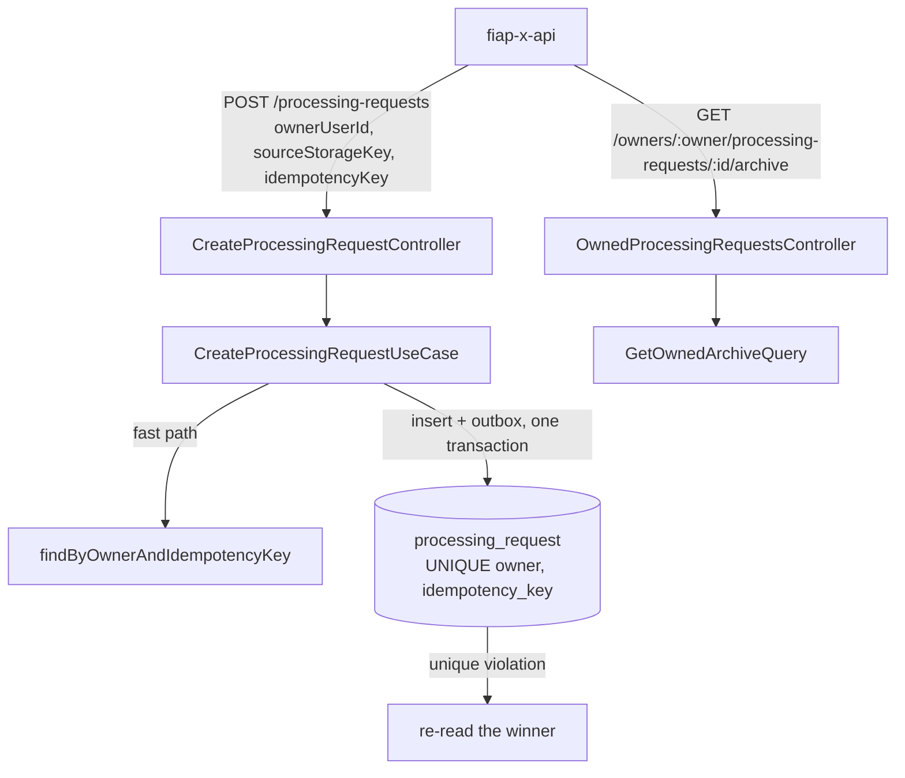

# Upload and Download Design — catalog

**Spec**: `.specs/features/upload-download/spec.md`
**Context**: `fiap-x-platform/.specs/features/upload-download/context.md`
**Status**: Draft

---

## Project decisions this design conforms to

| Decision | How this design conforms |
| --- | --- |
| **AD-009** — TypeORM, migrations only | The key column and its unique index are one versioned migration |
| **AD-010** — only the outbox publishes | A replay writes no outbox row, so a retried confirmation never emits a second `VideoValidationRequested` |
| **AD-013** — row locks on lifecycle writes | Untouched; creation inserts a new row and relies on the unique index, not on a lock |

**No new project-level decision is proposed.** No architectural alternative is worth presenting: the spec fixes the storage (a column plus a unique index) and the route.

---

## Architecture Overview



---

## Code Reuse Analysis

| Component | Location | How to Use |
| --- | --- | --- |
| `CreateProcessingRequestUseCase` | `src/application/create-processing-request.use-case.ts` | Gains `idempotencyKey` and returns `{ request, outcome }` |
| Unit of work + outbox | `src/application/unit-of-work.ts` | Insert and event stay in one transaction |
| Unique-violation handling | `notification-service/.../typeorm-delivery.repository.ts:61-71` (`23505` → existing row) | Same pattern for the concurrent insert |
| Owned controller, constant 404, UUID guard | `src/interface/owned-processing-requests.controller.ts` | The archive route joins it |
| Repository port | `src/domain/processing-request.repository.ts` | One new owner-scoped method |

---

## Components

### Migration `1789956000000-AddIdempotencyKey`

```sql
ALTER TABLE processing_request ADD COLUMN IF NOT EXISTS idempotency_key text NULL;
CREATE UNIQUE INDEX IF NOT EXISTS uq_processing_request_owner_idempotency
  ON processing_request (owner_user_id, idempotency_key);
```

`NULL` keys (rows created before S6) never collide in a PostgreSQL unique index. `down()` drops the index and the column.

### Domain and entity

- `ProcessingRequest` gains `idempotencyKey: string | undefined`; `createProcessingRequest` takes it; the entity maps `idempotency_key`.

### Repository

- `findByOwnerAndIdempotencyKey(owner, key): Promise<ProcessingRequest | undefined>` on the port, TypeORM and in-memory.
- The in-memory `save` enforces the same uniqueness and raises the same `DuplicateIdempotencyKeyError` the TypeORM adapter raises on `23505` for that index, so both adapters behave alike under the use case.

### CreateProcessingRequestUseCase (changed)

- **Input**: `{ eventId, ownerUserId, sourceStorageKey, idempotencyKey }` — `idempotencyKey` required (blank → domain error → 400).
- **Flow**:
  1. `existing = findByOwnerAndIdempotencyKey` → same `sourceStorageKey` → `{ existing, 'replayed' }`; different → `IdempotencyConflictError`
  2. insert request + outbox + event record in one transaction → `{ request, 'created' }`
  3. on `DuplicateIdempotencyKeyError` (a concurrent create won): the transaction rolled back, so nothing was written; re-read and apply step 1
- **Writes on replay or conflict**: none.

### CreateProcessingRequestController (changed)

- Requires `idempotencyKey`; answers `201` with the existing body on `created`, `200` on `replayed`, `409` on conflict.

### GetOwnedArchiveQuery and route

- **Route**: `GET /owners/:ownerUserId/processing-requests/:id/archive` in `OwnedProcessingRequestsController` (UUID guard and constant 404 reused).
- **Result**: `{ zipStorageKey }` when `COMPLETED`; `409` when owned but not completed; constant 404 otherwise.
- **Notes**: `findByIdAndOwner` already filters by owner; no new query.

---

## Error Handling Strategy

| Scenario | Handling | API sees |
| --- | --- | --- |
| Missing/blank `idempotencyKey` | `BadRequestException` | 400 |
| Replay (same owner, key, source) | Existing request, nothing written | 200 |
| Key bound to another source | `IdempotencyConflictError` | 409 |
| Concurrent insert loses | Unique violation → rollback → re-read | 200 with the winner's id |
| Archive of a non-completed request | 409 | 409 |
| Archive of another owner's / missing / malformed id | Constant 404 | 404 |

---

## Risks & Concerns

| Concern | Location | Impact | Mitigation |
| --- | --- | --- | --- |
| **Dedup by a fresh `eventId` never matches a retry** | `src/interface/create-processing-request.controller.ts:19` | Without the new key, every API retry would create a request | The unique `(owner, idempotency_key)` is the guarantee; a concurrency e2e against PostgreSQL proves one row and one outbox entry |
| **A unique violation aborts the transaction** | TypeORM transaction | Re-reading inside the failed transaction would error | Catch outside `runInTransaction`, then re-read on a fresh query |
| **In-memory adapter could diverge on uniqueness** | `src/infrastructure/in-memory-processing-request.repository.ts` | Unit tests pass, PostgreSQL fails | In-memory enforces the same constraint and error; the race is proven only against PostgreSQL |
| **Generated database script** | `fiap-x-platform/db/create-database.sql` | Missing the column and index | Regenerated in the platform tasks |

---

## Tech Decisions (only non-obvious ones)

| Decision | Choice | Rationale |
| --- | --- | --- |
| Concurrency guarantee | Unique index, not a lock | There is no row to lock before the first insert |
| Replay status | 200 (created: 201) | The API maps it straight to its own 200 |
| Key stored in plain text | Yes | It is a client-chosen token, not a secret; it must be matched exactly |
