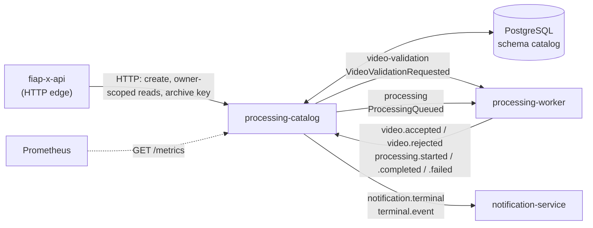
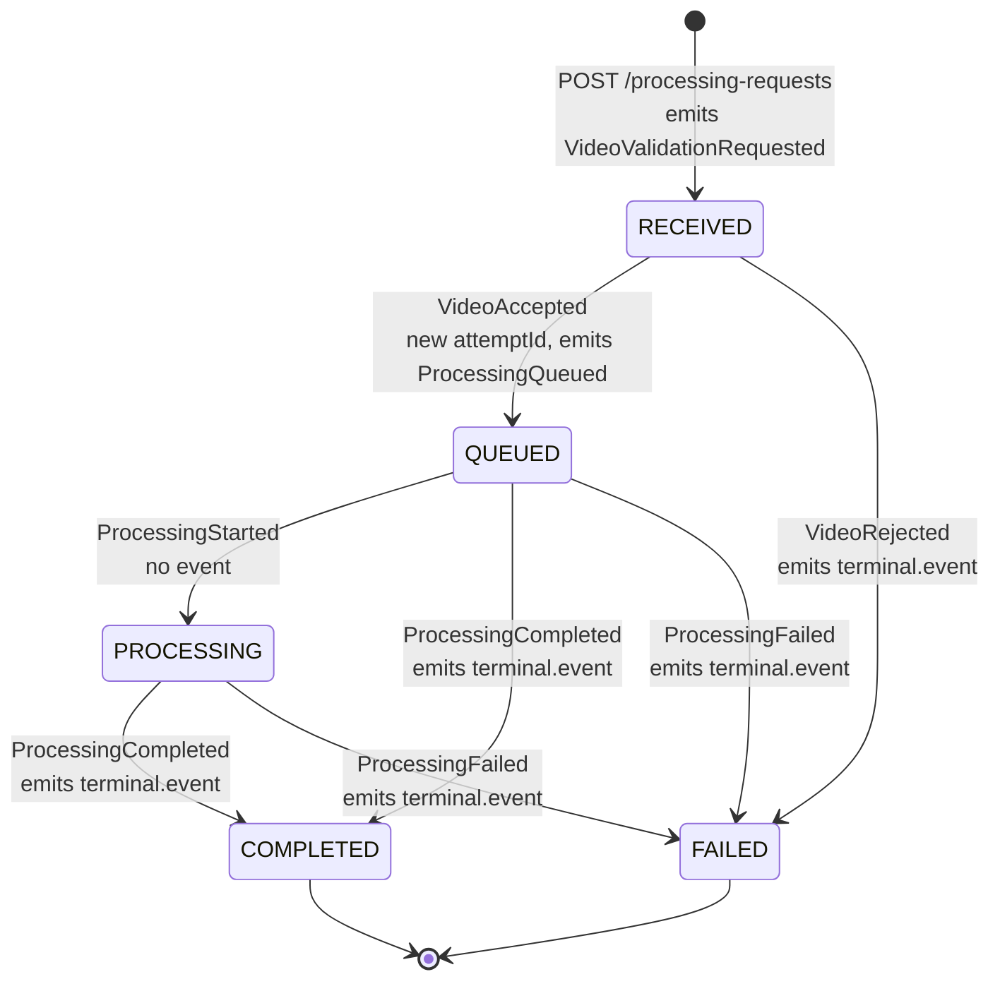

# Processing Catalog

Processing Catalog owns the durable lifecycle of each FIAP X `ProcessingRequest`. It persists state in PostgreSQL, enforces the state machine, serves owner-scoped status queries to the API, and publishes integration events reliably through a transactional outbox.

It is one of four services in FIAP X, a video-processing system built for the FIAP POSTECH SOAT phase 5 hackathon. The system overview, runtime topology and decision log (AD-001 to AD-018) live in [`fiap-x-platform`](https://github.com/tech-challenge-workshop/fiap-x-platform). What this service owns and does not own is in [the service boundary](docs/service-boundary.md).

## Place in the system



Every arrow between services except the API call goes through RabbitMQ. The API is the Catalog's only HTTP caller; the Catalog never calls another service over HTTP and shares no tables with anyone.

## State machine



The transitions are pure functions in [`src/domain/processing-request.ts`](src/domain/processing-request.ts); the use cases in `src/application/` wrap them in the guards below.

- **Row lock.** Every consumed event is applied inside one transaction that first reads the request with `SELECT ... FOR UPDATE` (`findForUpdate`). Two events for the same request, such as a start and a completion racing on different queues, serialize on that lock (AD-013).
- **Deduplication by `eventId`.** Each applied event is recorded in `processed_event`, whose primary key is the `eventId`. The use case checks it before the transaction and again under the lock, so a redelivery returns the stored request and changes nothing.
- **Attempt ids.** Accepting a video assigns a fresh `attemptId`. `ProcessingStarted`, `ProcessingCompleted` and `ProcessingFailed` must carry a non-blank `attemptId`, or the message is dead-lettered. An event whose `attemptId` differs from the request's current one is stale: it is recorded as processed and acknowledged, never applied.
- **Out-of-order and repeated events.** A completion is accepted from `QUEUED`, because it can overtake its own start. A start that finds the request already `PROCESSING`, `COMPLETED` or `FAILED` changes nothing. A completion that restates the stored `zipStorageKey` changes nothing and publishes nothing, so the owner is not notified twice. Each of these no-ops still records the event.
- **Refused transitions.** Anything else - accepting a request that is not `RECEIVED`, rejecting one that already has an attempt, starting a `RECEIVED` request, completing or failing a terminal one, an unknown request id, or a failure code outside `FORMATO_INVALIDO`, `DURACAO_EXCEDIDA`, `PROCESSAMENTO_FALHOU` - raises a domain error, and the message is dead-lettered.
- **Idempotent creation.** `POST /processing-requests` requires an `idempotencyKey`. The same owner and key with the same source replays the existing request (200); the same key with another source is a conflict (409). A new key for a source the owner already has also replays the existing request: one upload is one request. Concurrent creates are settled by the unique indexes `uq_processing_request_owner_idempotency` and `uq_processing_request_owner_source`; the loser's transaction rolls back and it answers with the winner.

`failureCode` is the stored fact. The user-facing sentence (`failureReason`, in Portuguese) is derived from it at publication and on reads by [`failure-reason.ts`](src/domain/failure-reason.ts), and is never persisted.

## Messaging

All events are JSON in a Nest envelope, `{ "pattern": ..., "data": ... }`. The Catalog publishes through the default exchange straight to the named queue, and only the outbox relay publishes (AD-010). Consumers accept the envelope or a flat body.

### Published

| Event (`pattern`) | Queue | When | Payload highlights |
| --- | --- | --- | --- |
| `VideoValidationRequested` | `video-validation` | A request is created | `eventId`, `processingRequestId`, `ownerUserId`, `sourceStorageKey`, `occurredAt` |
| `ProcessingQueued` | `processing` | `VideoAccepted` moves the request to `QUEUED` | the above plus `attemptId` |
| `terminal.event` | `notification.terminal` | The request reaches `COMPLETED` or `FAILED` | `status`, `ownerUserId`, `ownerEmail`, `attemptId` (absent after a validation rejection), then `zipStorageKey` when completed or `failureReason` when failed |

Every published event carries `correlationId` when the stored request has one, and omits the field otherwise; it is never `null` (AD-016). `ownerEmail` is only on the terminal event (AD-015). Entering `PROCESSING` publishes nothing: no other service acts on it.

### Consumed

| Queue | Event | Handler | Required fields |
| --- | --- | --- | --- |
| `video.accepted` | `VideoAccepted` | `AcceptProcessingRequestUseCase` | `eventId`, `processingRequestId`, `occurredAt` |
| `video.rejected` | `VideoRejected` | `FailProcessingRequestUseCase` (origin `validation`) | plus `failureCode` |
| `processing.started` | `ProcessingStarted` | `StartProcessingRequestUseCase` | plus `attemptId` |
| `processing.completed` | `ProcessingCompleted` | `CompleteProcessingRequestUseCase` | plus `attemptId`, `zipStorageKey` |
| `processing.failed` | `ProcessingFailed` | `FailProcessingRequestUseCase` (origin `processing`) | plus `attemptId`, `failureCode` |

Every consumer settles through one function, `settleMessage` in [`settle-failed-message.ts`](src/infrastructure/rabbitmq/settle-failed-message.ts) (AD-012):

- **Success**: `ack`, and `fiapx_events_consumed_total{event,outcome="acked"}` is incremented.
- **Permanent failure** (a domain error or a body that is not JSON): `nack` without requeue. The broker's `dead-letter` policy, owned by `fiap-x-platform`, routes it to `<queue>.dlq`. Counted as `outcome="dead_lettered"`.
- **Anything else** (presumed transient, such as the database being away): wait `RABBITMQ_RETRY_BACKOFF_MS`, then `nack` with requeue. Not counted; the redelivery is counted when it settles. RabbitMQ 4 does not count an explicit requeue toward a quorum queue's delivery limit, so the pause is what keeps this loop from spinning, and a transient outage never dead-letters in-flight messages.

Each message is handled inside a correlation scope taken from its `correlationId`, or a fresh UUID when it is absent or invalid; an invalid id never fails a message.

### Topology the service declares

At channel setup the Catalog asserts the topic exchanges `fiapx.events` and `fiapx.events.dlx`, and for each name in `RABBITMQ_QUEUES` ([`rabbitmq.connection.ts`](src/infrastructure/rabbitmq/rabbitmq.connection.ts)) a durable queue bound to `fiapx.events` and a `<name>.dlq` bound to the DLX. It sets no queue arguments: dead-lettering and the delivery limit are a broker policy, so no declarer can contradict another (AD-011). The queues that carry traffic, including the three it publishes to, are declared by the broker definitions in `fiap-x-platform` (AD-012). Three names on that list, `video.validation.requested`, `processing.queued` and `processing.terminal`, are declared but nothing publishes to them.

## Persistence

The service owns the `catalog` schema. It shares a PostgreSQL server with the Notification Service but no tables, and each role is denied the other's schema. The schema and role are created by the platform's bootstrap, [`db/init/01-schemas.sql`](https://github.com/tech-challenge-workshop/fiap-x-platform/blob/main/db/init/01-schemas.sql); the tables come from this repository's migrations.

| Table | Columns | Constraints and indexes |
| --- | --- | --- |
| `processing_request` | `processing_request_id uuid`, `owner_user_id text`, `owner_email text`, `source_storage_key text`, `status text`, `attempt_id uuid NULL`, `zip_storage_key text NULL`, `failure_code text NULL`, `idempotency_key text NULL`, `correlation_id varchar(128) NULL`, `created_at`, `updated_at timestamptz` | PK on the id; unique `(owner_user_id, idempotency_key)`; unique `(owner_user_id, source_storage_key)`; `(owner_user_id, created_at DESC, processing_request_id)` for the owner's page and count |
| `processed_event` | `event_id text`, `processing_request_id uuid NULL`, `processed_at timestamptz` | PK on `event_id`: deduplication is a schema guarantee |
| `outbox` | `id bigserial`, `queue text`, `pattern text`, `payload jsonb`, `created_at timestamptz`, `published_at timestamptz NULL` | Partial index on `id` where `published_at IS NULL` |

Migrations, in order, in [`src/infrastructure/persistence/migrations/`](src/infrastructure/persistence/migrations/): `CreateProcessingRequest`, `CreateOutbox`, `IndexProcessingRequestOwnerCreatedAt`, `AddIdempotencyKey`, `UniqueOwnerSource`, `AddOwnerEmail`, `AddCorrelationId`.

### Why a transactional outbox

A state transition and the event announcing it are one business fact. The request row, its `processed_event` record and the outbox row are written in the same transaction, so they commit or roll back together. A relay publishes pending rows and marks them sent only after the broker confirms. If the broker is unreachable the transition still commits and the event waits; nothing is lost.

Delivery is therefore at-least-once: a crash between the confirm and the mark republishes a row. Every consumer deduplicates by `eventId`, so a repeat is absorbed, and losing an event is the worse failure.

### The relay

[`OutboxRelay`](src/infrastructure/messaging/outbox-relay.ts), driven every `OUTBOX_POLL_INTERVAL_MS` by `OutboxRelayScheduler`:

- Opens a transaction and takes `pg_try_advisory_xact_lock` on a fixed key. If another replica holds it, the tick does nothing. There is no `SKIP LOCKED`: one replica drains at a time, which keeps a global `ORDER BY id` and so the recorded order of each request's events.
- Reads up to 50 pending rows in `id` order and publishes each with a confirm timeout of `OUTBOX_PUBLISH_TIMEOUT_MS`, marking `published_at = now()` after each confirm.
- Stops at the first refusal or timeout, commits the marks already made, and leaves the failed row pending for the next tick. The failure increments `fiapx_outbox_publish_failures_total` and is logged; it never stops the interval.
- A tick is skipped while the previous one is still draining.

### Migration workflow

Migrations are the only way the schema changes: `synchronize` is off, so a running service can never reshape a table under itself (AD-009). They are applied at startup, before any event is accepted: the composition root calls `dataSource.runMigrations()` when `DATABASE_HOST` is set. TypeORM records each applied migration and the DDL is guarded with `IF [NOT] EXISTS`, so applying them twice changes nothing.

`npm run migration:run` is known to be broken (tracked as V62): the TypeORM CLI requires the data source file to export a `DataSource` instance, and [`data-source.ts`](src/infrastructure/persistence/data-source.ts) exports a factory, so it fails with "Given data source file must contain export of a DataSource instance". Start the service to migrate.

The consolidated creation script the challenge asks for is generated from these migrations in `fiap-x-platform` ([The database creation script is generated](https://github.com/tech-challenge-workshop/fiap-x-platform#the-database-creation-script-is-generated)), not maintained here. A script written beside migrations drifts from them, and the drift stays invisible until someone runs it.

### Running without a database

**A database is required for the integrated flow.** When `DATABASE_HOST` is unset the service still starts, but the composition root selects an in-memory repository and an in-memory outbox with no relay behind it: transitions are applied, events are recorded, and nothing ever reaches the broker. Downstream services never hear from this one, and the database health check stays green while it happens.

That mode exists for tests that mean to exercise it, and those suites pin the choice explicitly rather than inheriting it from the environment. Anything resembling a running system - the Compose stack, Kubernetes, a manual trial - must set the `DATABASE_*` variables below. [`test/composition.e2e-spec.ts`](test/composition.e2e-spec.ts) asserts which implementations the composition root selects in each case, because this wiring once existed complete and unreferenced while 36 tests passed.

## Architecture

| Layer | Responsibility |
| --- | --- |
| Domain | The aggregate and its transitions as pure functions; the repository port. No framework or persistence annotations. |
| Application | Use cases and owner-scoped queries; the `UnitOfWork` and `OutboxWriter` ports; where each event goes (`EVENT_ROUTES`). |
| Infrastructure | TypeORM/PostgreSQL adapters, the outbox relay, RabbitMQ connection and consumers, in-memory adapters. |
| Interface | HTTP controllers and input validation. |
| Messaging | Event DTOs, declared locally rather than shared (AD-003). |
| Observability | Logging, correlation, metrics. |

```text
src/
  main.ts                        bootstrap: pino logger, listens on PORT
  app.module.ts                  composition root: PostgreSQL or in-memory, migrations at boot
  domain/                        ProcessingRequest, state transitions, failure reasons, repository port
  application/                   use cases, owner-scoped queries, unit of work and outbox ports, event routes
  interface/                     HTTP controllers (create, owner-scoped reads, health, local observation)
  messaging/dto/                 local contracts of every published and consumed event
  infrastructure/                in-memory repository, unit of work and publisher
  infrastructure/persistence/    TypeORM entities, repository, unit of work, data source, migrations, DB health
  infrastructure/messaging/      outbox relay and its scheduler, per-message correlation scope
  infrastructure/rabbitmq/       connection and topology, five consumers, settlement policy, broker health
  observability/                 pino config, correlation context and middleware, metrics registry and endpoint
test/                            e2e suites; support/ holds the e2e database harness
```

Key choices:

- **The repository reaches a use case through the transaction context**, not by injection, so a write inside `runInTransaction` cannot escape the transaction ([`unit-of-work.ts`](src/application/unit-of-work.ts)).
- **Only the relay talks to the broker** (AD-010). `RabbitMQEventPublisher` and `InMemoryEventPublisher` are still registered under an `EventPublisher` token, but nothing injects it.
- **Lifecycle events are applied under a row lock** and the machine tolerates start/completion order (AD-013).
- **Failures are classified by the consumer**: permanent to the DLQ, transient requeued after a pause (AD-012).
- **Schema per service, migrations at boot, no `synchronize`** (AD-009).
- **Owner scope is in the query**: every owner read filters on the owner in SQL, and the repository has no unscoped list method. The Catalog does no authentication; the API validates the JWT and passes the owner.

## HTTP API

| Method | Path | Purpose | Status codes |
| --- | --- | --- | --- |
| `POST` | `/processing-requests` | Create a request. Body: `ownerUserId` (max 255), `ownerEmail` (max 255), `sourceStorageKey` (max 1024), `idempotencyKey` (max 255), optional `correlationId` (1 to 128 printable ASCII). Answers `processingRequestId`, `status`, `ownerUserId`, `sourceStorageKey`, `createdAt`. | 201 created, 200 replayed, 400 invalid field, 409 key bound to another source |
| `GET` | `/owners/:ownerUserId/processing-requests` | The owner's requests, newest first. `page` (default 1), `pageSize` (default 20, max 100). Answers `items`, `page`, `pageSize`, `total`. | 200, 400 invalid paging |
| `GET` | `/owners/:ownerUserId/processing-requests/:id` | One request: `processingRequestId`, `status`, `createdAt`, `updatedAt`, and `failureReason` when `FAILED`. No storage keys. | 200, 404 (missing, another owner's, or not a UUID - one body for all) |
| `GET` | `/owners/:ownerUserId/processing-requests/:id/archive` | `zipStorageKey` of a completed request; the API turns it into a download URL. | 200, 404 as above, 409 not completed |
| `GET` | `/processing-requests/:id` | Full unscoped record, for the local smoke. Registered only when `LOCAL_INTEGRATION=true`. | 200, 404 |
| `GET` | `/health` | Readiness: RabbitMQ connection and `SELECT 1` on the database. | 200 `{status:"ok",rabbitmq:"up",database:"up"}`, 503 naming what is down |
| `GET` | `/health/live` | Liveness; consults no dependency. | 200 |
| `GET` | `/metrics` | Prometheus exposition. | 200 |
| `GET` | `/` | Nest scaffold route; returns `Hello World!`. | 200 |

Every response echoes `X-Correlation-Id`: the request's header when valid, a fresh UUID otherwise. The header only scopes that request's logs; the id stored on a new request is the body's `correlationId`.

## Tech stack

| Component | Version |
| --- | --- |
| Node.js | 22 (Docker image and CI) |
| TypeScript | ^5.7.3 |
| NestJS (`common`, `core`, `platform-express`) | ^11.0.1 |
| TypeORM / `pg` | ^0.3.31 / ^8.23.0 |
| `amqp-connection-manager` / `amqplib` | ^5.0.0 / ^2.0.1 |
| `nestjs-pino` | ^5.2.1 |
| `prom-client` | ^15.1.3 |
| Jest / ts-jest / supertest | ^30.0.0 / ^29.2.5 / ^7.0.0 |
| ESLint / Prettier | ^9.18.0 / ^3.4.2 |
| PostgreSQL (stack and CI) / RabbitMQ (stack) | 17 / 4 |

## Observability

- **Logs**: one JSON object per line from `nestjs-pino`, carrying `service: "processing-catalog"`, `timestamp` and, inside a request or message, `correlationId`. Authorization and cookie headers, `email`, `ownerEmail`, `zipStorageKey` and `sourceStorageKey` are removed. `/health`, `/health/live` and `/metrics` are kept out of the access log (AD-017).
- **Health**: `/health` answers 503 when the broker connection or the database is lost, so the pod goes not-ready; `/health/live` stays 200, so it is not restarted for an outage. Without a database configured, the database check reports up.
- **Metrics** on a dedicated registry (no default process metrics):

| Metric | Type | Labels |
| --- | --- | --- |
| `fiapx_outbox_pending_rows` | gauge | - |
| `fiapx_outbox_oldest_pending_seconds` | gauge (0 when none pending) | - |
| `fiapx_outbox_publish_failures_total` | counter | - |
| `fiapx_events_consumed_total` | counter | `event`, `outcome` (`acked`, `dead_lettered`) |
| `fiapx_http_requests_total` | counter | `method`, `route` (template or `unmatched`), `status` |
| `fiapx_http_request_duration_seconds` | histogram | `method`, `route`, `status` |

The outbox gauges are read from the relay's queries at scrape time, so they are only fed when a database is configured; if the database is away they keep their last value rather than fail the scrape.

## Configuration

| Variable | Default | Purpose |
| --- | --- | --- |
| `PORT` | `3000` | HTTP port (the stack uses `3001`) |
| `DATABASE_HOST` | unset | Selects PostgreSQL; unset means in-memory mode (see above) |
| `DATABASE_PORT` | `5432` | PostgreSQL port |
| `DATABASE_NAME` | `fiapx` | Database; e2e suites default to `fiapx_e2e` and refuse `fiapx` |
| `DATABASE_SCHEMA` | `catalog` | Schema the tables and migrations live in |
| `DATABASE_USER` / `DATABASE_PASSWORD` | `catalog` / `catalog` | Least-privilege service role |
| `RABBITMQ_URL` | `amqp://rabbitmq:5672` | Broker; the connection manager reconnects on its own |
| `RABBITMQ_RETRY_BACKOFF_MS` | `1000` | Pause before requeueing a transient failure; `0` is valid, blank or invalid means the default |
| `OUTBOX_POLL_INTERVAL_MS` | `1000` | Relay tick; read once at module load |
| `OUTBOX_PUBLISH_TIMEOUT_MS` | `5000` | Broker confirm timeout per row; zero, negative, blank or invalid mean the default |
| `LOCAL_INTEGRATION` | unset | `true` registers `GET /processing-requests/:id` |
| `LOG_LEVEL` | `info` | pino level; the e2e setup defaults it to `fatal` |
| `DATABASE_ADMIN_USER` / `DATABASE_ADMIN_PASSWORD` | `postgres` / `postgres` | e2e global setup only: creates the e2e database |

## Running

### With the whole system

The normal way to run the Catalog is the platform's Compose stack, which builds it from this checkout (all five repositories side by side), with PostgreSQL, RabbitMQ and `LOCAL_INTEGRATION=true`, on `localhost:3001`. See [Running locally](https://github.com/tech-challenge-workshop/fiap-x-platform#running-locally). The kind/Kubernetes topology pulls the image CI publishes ([Local Kubernetes (kind)](https://github.com/tech-challenge-workshop/fiap-x-platform#local-kubernetes-kind)).

### Scripts

```sh
npm ci
npm run start:dev      # watch mode; set DATABASE_* and RABBITMQ_URL first
npm run build && npm run start:prod
npm run lint           # zero warnings allowed
npm run typecheck
npm test               # unit suites (src/**/*.spec.ts), no database needed
npm run test:e2e       # e2e suites (test/*.e2e-spec.ts)
```

The e2e suites that need persistence run only when `DATABASE_HOST` is set and are skipped otherwise. They need a PostgreSQL with the `catalog` role, for example the stack's own:

```sh
DATABASE_HOST=localhost DATABASE_PORT=5432 DATABASE_SCHEMA=catalog \
DATABASE_USER=catalog DATABASE_PASSWORD=catalog npm run test:e2e
```

The global setup creates `fiapx_e2e` and its schema as the admin user, so the stack's `fiapx` database is never touched. Suites run serially (`maxWorkers: 1`).

### Docker

```sh
docker build -t processing-catalog .
```

A two-stage `node:22-alpine` build: `npm ci` and `nest build`, then a runtime stage with production dependencies only, running `node dist/main` as the `node` user on port 3000.

### CI

[`.github/workflows/ci.yml`](.github/workflows/ci.yml) runs on pull requests to `main` and on pushes to `main`:

- **`quality`**: starts a `postgres:17-alpine` service, applies the platform's `db/init/01-schemas.sql` (sparse checkout of `fiap-x-platform`) so the role and schema match the stack, then runs lint, typecheck, unit tests with coverage, e2e tests, and build. The job fails if any e2e test was skipped, so a green run means the persistence suites actually ran. The coverage report is uploaded as an artifact.
- **`image`**: after `quality`, builds `linux/amd64` and `linux/arm64` with Buildx. On a push to `main` only, it logs in to GHCR with `GITHUB_TOKEN` and pushes `ghcr.io/tech-challenge-workshop/processing-catalog:<sha>` and `:main` (the tag the kind cluster pulls, AD-018). Pull requests build without pushing.

## Links

- System: [`fiap-x-platform`](https://github.com/tech-challenge-workshop/fiap-x-platform), its [decision log](https://github.com/tech-challenge-workshop/fiap-x-platform/blob/main/.specs/STATE.md) and [foundation document](https://github.com/tech-challenge-workshop/fiap-x-platform/blob/main/docs/foudation.md)
- Siblings: [`fiap-x-api`](https://github.com/tech-challenge-workshop/fiap-x-api), [`processing-worker`](https://github.com/tech-challenge-workshop/processing-worker), [`notification-service`](https://github.com/tech-challenge-workshop/notification-service)
- This repository: [service boundary](docs/service-boundary.md), [roadmap](docs/ROADMAP.md), [feature specs](.specs/features/), [lessons](.specs/LESSONS.md)
- Specs most relevant to the above: [full lifecycle](.specs/features/full-lifecycle/spec.md), [durable persistence](.specs/features/durable-persistence/spec.md), [messaging hardening](.specs/features/catalog-messaging-hardening/spec.md), [service robustness](.specs/features/service-robustness/spec.md), [owner scope](.specs/features/auth-owner-scope/spec.md), [observability](.specs/features/observability/spec.md), [CI pipeline](.specs/features/ci-pipeline/spec.md)
